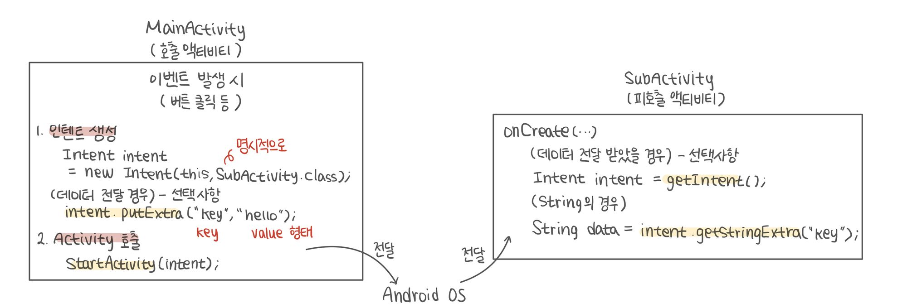

# 액티비티 (Activity)

## **☝️** 액티비티 (Activity)

> 하나의 화면을 제어하는 **`안드로이드 핵심 컴포넌트`** → *액티비티, 서비스, 컨텐츠 프로바이더, 방송 수신자*
> 
- 액티비티의 일반적인 파일 구성
    - **액티비티에 표시할 View** : 보통 XML로 작성 → *MainActivity.java*
    - **Activity 클래스** (상속받아 사용) → *activity_main.xml*
- 새로운 액티비티 추가 (직접 작성)
    - 액티비티에 표시할 View(layout) XML 파일 작성 (코딩 시 생략)
        
        → setContentView(R.id.activity_sub) (onCreate 안에)
        
    - Activity 클래스 추가
        - Activity Class 상속 (하위호환이 필요할 경우 AppCompatActivity)
        - 상속 메소드 중 onCreate() 메소드는 반드시 구현
    - AndroidManifest.xml에 액티비티 정보 등록
- 새로운 액티비티 추가 (프로그램 보조)
    - 프로젝트 명에서 우클릭 → [New] → [Activity] → 용도별 액티비티 선택하여 추가

---

## 1. 인텐트 (Intent)

> 안드로이드 컴포넌트 사이의 통신 수단
> 

### ✏️ 1-1. 인텐트를 사용한 컴포넌트 실행 메소드

- 다른 컴포넌트를 실행시키기 위한 정보를 인텐트에 저장
- 인텐트를 전달하여 컴포넌트 실행
    - 전달 메소드
        
        :  startActivity() / startActivityForResult() / startService() / sendBroadcast()
        
    - ex) SubActivity 액티비티를 실행
        
        ```java
        // this : Intent를 사용하는 Context / SubActivity.class : 실행할 Activity 정보
        Intent intent = new Intent(this, SubActivity.class);
        // 사이에 Intent 내용물 추가 가능
        startActivity(intent);  // 새로운 Activity 실행 메소드
        ```
        

### ✏️ 1-2. 인텐트 정보

- 인텐트의 유형
    1. **Explicit Intent** (명시적 인텐트) → 실행 대상을 명확히 지정
    2. **Implicit Intent** (묵시적 인텐트) → 적절한 대상의 조건만을 지정하여 호출
        
        ex) 카메라 기능이 있는 것을 띄우도록
        
- 인텐트 주요 생성자
    
    ```java
    Intent (Context packageContext, Class<?> targetClass) // 명시적 인텐트
    Inent (String action [,Uri uri])  // 묵시적 인텐트
    ```
    
- 인텐트에 저장할 수 있는 정보
    
    → Action, Data, Type, Category, Component, Extras(가장 사용 많이), Flags
    
    (각 정보에 대해 setter/getter 존재)
    

---

## 2. 액티비티 사이의 정보 전달

### ✏️ 2-1. 인텐트를 이용한 정보 전달

- 인텐트의 Extras 필드 이용
    - 개발자 임의로 전달하려는 데이터가 있을 때 사용
    - Bundle 타입의 키와 값의 조합으로 자료 저장 가능
    - 대부분의 자료형과 객체도 `저장` 가능
        
        ```java
        Intent putExtra (String name, int value)
        Intent putExtra (String name, String value)
        Intent putExtra (String name, boolean value)
        Intent putExtra (String name, Serializable value) // 특정 객체를 Intent로 전달할 때
        // 해당 객체는 Serializable 인터페이스를 구현한 클래스의 객체여야 함
        // ArrayList 등의 컬렉션 클래스는 Serializable를 구현하고 있음
        ```
        
    - 인텐트에 저장한 Extra 필드 값 `읽기`
        
        ```java
        // defaultValue : intent에 내용물이 없을 때 사용
        intent getIntExtra (String name, int defaultValue) 
        String getString Extra (String name)
        boolean getBooleanExtra (String name, boolean defaultValue)
        Serializable getSerializableExtra (String name)
        ```
        

### ✏️ 2-2. 인텐트를 이용한 정보 전달 - String의 경우

- 호출 액티비티 (MainActivity.java)
    
    ```java
    Intent intent = new Intent(this, SubActivity.class);
    
    // Extras를 이용하여 자료 저장
    intent.putExtra("subject", "moblie software");
    
    startActivity(intent);
    ```
    
- 피호출 액티비티 (SubActivity.java)
    
    ```java
    @Override
    protected void onCreate(Bundle savedInstanceState) {
    	super.onCreate(savedInstanceState);
    	setContentView(R.layout.activity_sub);
    
    	Intent intent = getIntent();  // 실행 시 전달 받은 Intent 확보
    
    	String data = intent.getStringExtra("subject");
    
    	Log.v("SubActivity", "subject: " + data);
    }
    ```
    

*✔️*  ***Activity 실행*** → 새로운 액티비티 실행할 경우

- 

### ✏️ 2-3. 인텐트를 이용한 정보 전달 - 결과값 반환

- 호출 액티비티 (MainActivity.java)
    - `startActivityForResult()`를 사용하여 액티비티 호출
    - 피호출 액티비티의 반환 결과를 `onActivityResult()`로 확인
    
    ```java
    final static int SUB_ACTIVITY_CODE = 100; // 호출 구분을 위한 상수 선언
    
    public void onClick(View view) {
    	switch(view.getId() {
    		case R.id.button:
    			Intent intent = new Intent(this, SubActivity.class);
    			startActivityForResult(intent, SUB_ACTIVITY_CODE);  // 호출 부분
    			break;
    	}
    }
    
    @Override
    // 반환 결과 확인 부분
    // 호출한 액티비티를 종료하고 결과값을 전달받으면 자동 호출
    protected void onActivityResult(int requestCode, int resultCode, Intent data) {
    // requestCode : SUB_ACTIVITY_CODE 값 
    // resultCode : RESULT_OK or RESULT_CANCEL 
    // data : 결과값을 담고 있는 인텐트
    	switch(requestCode) {
    		case SUB_ACTIVITY_CODE:
    			if (resultCode == RESULT_OK) {
    				String resultData = data.getStringExtra("result_data");
    				Toast.makeText(this, "Result: " + resultData, Toast.LENGTH_SHORT).show();
    			}
    			break;
    	}
    }
    ```
    
- 피호출 액티비티 (SubActivity.java)
    - `setResult()`에서 결과 상태와 결과를 저장할 인텐트 생성
    - 결과 설정 후 `finish()`를 호출하여 액티비티 종료
    
    ```java
    public void onClick(View view) {
    	switch(view.getId()) {
    		case R.id.sub_button_ok:
    			Intent resultIntent = new Intent();  // 결과값 저장 할 intent
    			resultIntent.putExtra("result_data", "SubActivity returns data");
    			setResult(RESULT_OK, resultIntent);  // 정상 반환일 경우 RESULT_OK 전달 (Activity 상수)
    			break;
    		case R.id.sub_button_cancel:
    			setResult(RESULT_CANCELED);  // 취소일 경우 RESULT_CANCELED 전달 (Activity 상수)
    			break;
    	}
    	finish();  // 현재 액티비티 종료
    }
    ```
    

*✔️*  ***Activity 실행*** → 새로 실행한 Activity에서 실행 결과를 받고자 할 경우

- 

### ✏️ 2-3. 이전 액티비티로 탐색 추가

- 앱 호출 계층 (Main : Sub)에 따른 이전 화면 가기
    
    → AndroidManifest 편집
    
    ```xml
    <activity android name=".MainActivity">
    	<intent-filter> <!-- 앱에서 하나의 액티비티가 이 부분을 가지고 있어야함 -->
    		<action android:name="android.intent.action.MAIN" />
    		<action android:name="android.intent.category.LAUNCHER" />
    	</intent-filter>
    </activity>
    
    <activity android:name=".SubActivity">
    	<meta-data
    		android:name="android.support.PARENT_ACTIVITY"
    		android:value=".MainActivity" /> <!-- 클릭 시 이전 Activity로 복귀 -->
    </activity>
    ```
    

---

## 3. 묵시적 인텐트 사용

> 외부 패키지의 안드로이드 컴포넌트 호출
> 
> 
> ex) 내 앱에서 외부에 있는 카매라앱 호출하기
> 
- 특정 기능에 대한 정보를 인텐트에 저장한 후 호출
    
    → 안드로이드 운영체제가 인텐트를 토대로 적합한 컴포넌트를 검색 후 실행 
    
    (각 앱의 AndroidManifest 참조)
    
- 사용 예
    - 지정한 웹주소 확인
        
        ```java
        intent = new Intent(Intent.ACTION_VIEW, Uri.parse("http://www.google.com"));
        startActivity(intent);
        ```
        
    - 지정한 번호로 전화 기능 실행
        
        ```java
        intent = new Intent(Intent.ACTION_DIAL, Uri.parse("tel:012-3456-7890"));
        startActivity(intent);
        ```
        

---

## 4. Activity의 Life Cycle

- Activity는 실행 시 여러 상태를 거치게 됨
    
    : 생성 → 준비 → 사용 → 대기 ...
    
    - 생성부터 최종적으로 파괴까지의 상태 변화를 Activity의 생명주기 (Life Cycle)이라고 지칭
- ***Activity Stack***
    
    = 화면 상에 쌓이는 순서
    
    - 실행 중인 Activity를 차례대로 저장
    - Stack 상의 Activity 상태
        1. **실행** : 사용자가 Activity를 화면에서 사용하는 상태
        2. **일시 정지** : 사용자에게 보이지만 대기 중인 상태
        3. **정지** : Activity가 완전히 가려저 사용자에게 보이지 않는 상태
- Activity의 실행 상태에 따라 Activity가 갖고 있는 Life Cycle 관련 메소드가 자동으로 실행

### ✏️ 4-1. Activity Lifecycle에 따른 메소드 호출

- 

### ✏️ 4-2. Activity Lifecycle 핵심 메소드

- `**onCreate()**`
    
    : Activity 화면 생성 등 생성을 위해 필요한 작업 수행 (Initialize)
    
    → 필수 구현
    
- `**onResume()**`
    
    : Activity가 사용자와 상호작용 하기 직전(보여지기 직전)에 호출
    
    → 화면 내용 갱신 등의 작업 수행
    
- `**onPause()**`
    
    : 다른 Activity에 가려지거나 Activity 전체가 보여지지 않을 때 호출
    
    → 앱 실행 중에 보존해야 할 정보가 있을 경우 이 메소드에서 백업 수행
    

---

## 5. Activity의 상태 정보 저장

### ✏️ 5-1. 상태 저장

- Activity 상태의 ***임시 저장*** → 앱 실행 중
    - Activity 상태의 실행 중 다른 Activity에 가려지거나 메인 화면으로 나왔다 복귀할 때 복구해야 할 상태 정보
    1. `onSaveInstanceState()`에 상태 ***저장***
    2. `onCreate` 또는 `onRestoreInstanceState` ***복구*** 수행
- Activity 상태 ***영구 저장*** → 앱 종료 전
    - 앱 설정 정보 등 앱 종료 후에도 유지되어야 할 정보
        
        (ex. life cycle 관련 메소드)
        
    1. `onPause`에서 Preference, DB, 파일 등을 사용하여 ***저장***
    2. `onCreate`에서 ***복구*** 수행

*✔️* ***onSavedInstanceState vs. onPause***

- **onPause** : Life cycle 관련 메소드이며 호출이 보장
    
    → 영구적인 데이터 저장
    
- **onSavedInstanceState** → 앱 실행 중에 유지할 데이터 저장

### ✏️ 5-2. 저장/복구 위치

- 상태 임시 저장
    - 저장 위치 → onSavedInstanceState 메소드
        
        ```java
        public void onSavedInstanceState(Bundle outState) {
        	suber.onSavedInstanceState(outState);
        	outState.putInt("x", x);  // 인수로 전달받은 Bundle에 상태 정보 저장
        }
        ```
        
    - 복구 위치
        1. onCreate
            
            ```java
            public void onCreate(Bundle savedInstanceState) { // 저장한 Bundle 없을 경우 null
            	super.onCreate(savedInstanceState**);
            
            	if (**savedInstanceState **== null) {
            		x = 50;
            	} else {
            		x =** savedInstanceState.getInt("x");
            	**}**
            }
            ```
            
        2. onRestoreInstanceState → onStart 다음에 호출됨
            
            ```java
            public RestoreInstanceState(Bundle outState) {
            	supter.RestoreInstanceState(outState);
            	x = outState.getInt("x");
            }
            ```
            
- 상태 영구 저장
    - Preference 사용
        - 앱 설정 정보 등을 저장하기 위한 용도로 사용
        - XML 파일 형태로 내부 저장소 고유의 위치에 저장
    - 저장 위치 → onPause
        
        ```java
        SharedPreferences pref = getSharedPreferences("SaveState", 0);
        SharedPreferences.Editor edit = pref.edit();
        edit.putInt("y", y);
        edit.commit();
        ```
        
    - 복구 위치 → onCreate