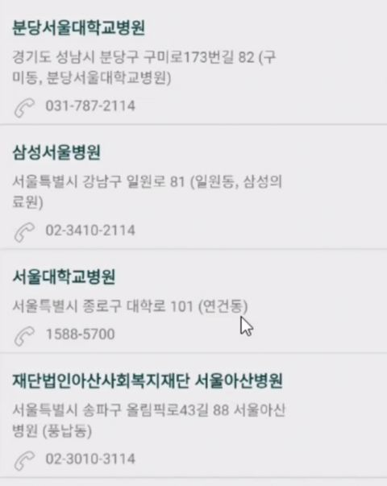

# 어댑터 뷰 (AdapterView)

## ☝️ AdapterView

> 여러개의 뷰를 보여줄 수 있는 ViewGroup의 일종
> 
- 여러 개의 View를 일정한 형태로 표시할 수 있는 ViewGroup
    
    → 표시할 View는 Adapter로부터 공급 받음
    
- 데이터 개수 제한이 없음
    
    → 스크롤 사용
    

    



AdapterView 예시

---

## 1. Adapter

> AdapterView에 표시할 View를 제공하는 클래스
> 
- 레이아웃과 데이터를 결합하여 Adapter View에 표시할 뷰 생성
- 결합 대상 데이터 형태 : 배열, 데이터베이스, XML 등


---

## 2. AdapterView 사용 개념도

<aside>
💡 **View의 개수 == 데이터 개수** && **View의 순서 == 데이터 순서**

</aside>


---

## 3. AdapterView 사용 절차

1. ***원본 데이터 준비*** : 보여줄 내용물 (배열, 데이터베이스, XML 등)
2. 데이터를 표시할 ***레이아웃 준비*** : 각 칸마다 표시될 view의 layout 
    - 기본 레이아웃
        
        
        | 리소스 ID | 설명 |
        | --- | --- |
        | simple_list_item_1 | 하나의 텍스트 뷰로 구성된 레이아웃 |
        | simple_list_item_2 | 두 개의 텍스트 뷰로 구성된 레이아웃 |
        | simple_list_item_checked | 오른쪽에 체크 표시가 나타남 |
        | simple_list_item_single_choice | 오른쪽에 라디오 버튼이 나타남 |
        | simple_list_item_multiple_choice | 오른쪽에 체크 버튼이 나타남 |
3. ***Adapter 객체 생성*** : ArrayAdapter(배열), CursorAdapter(DB), SimpleAdapter(XML)
4. ***AdapterView 객체 준비*** : `ListView`, Spinner, GridView, Gallery
5. ***AdapterView에 Adapter 연결*** : `Adapter.setAdapter(Adapter)`

---

## 4. AdapterView의 예

> ListView의 예시
> 

*❗️* Adapter의 layout을 radio로 설정해도 동작하지 않음
*✔️*  `choiceMode`를 `singleChoice`로 설정해야 함 (checkBox의 경우 multipleChoice)

```java
// 데이터 원본 준비
// 원본 데이터는 보통 외부에서 전달받음
ArrayList<String> subjectList = new ArrayList<String>();
subjectList.add("모바일소프트웨어");
subjectList.add("웹서비스");
subjectList.add("웹프로그래밍");

// 원본 데이터에 일반 배열을 사용할 경우
// String[] subjectList = {"모바일소프트웨어", "웹서비스", "웹프로그래밍"};

// 어댑터 생성
ArrayAdapter<String> adapter;
adapter = new ArrayAdapter<String> (this, // this == context(Activity 객체)
									android.R.layout.simple_list_item_1, subjectList);
									// simple_list_item_1 == 레이아웃 ID, subjectList == 원본데이터

// 어댑터 뷰 준비 및 어댑터 연결
ListView listView = (ListView) findViewById(R.id.listView);
listView.setAdapter(adapter);
```

---

## 5. Activity와 Data의 분리

> Activity와 별개로 List View에 표시할 데이터를 관리하는 별도의 클래스 사용이 필수
> 
- Activity는 화면 및 View 관리 용도
- 데이터베이스나 네트워크의 데이터를 사용할 경우 필수

```java
public class DataManager {
	
		private ArrayList<String> subjectList;
	
		public DataManager() {  // 생성자
				subjectList.add("모바일 소프트웨어");
				subjectList.add("네트워크");
				subjectList.add("운영체제");
				subjectList.add("웹프로그래밍");
		}
	
		public ArrayList<String> getSubjectList() {  // getter
				return subjectList;
		}
	
		// 필요에 따라 데이터의 추가나 삭제를 수행할 수 있는 멤버 메소드 추가
		public void addData(String newSubject) {
				subjectList.add(newSubject);
		}
	
		public void removeData(int idx) {
				subjectList**.remove(idx);**
		}

}
```

```java
DataManager dataManager = new DataManager();  // 멤버변수로 선언

ArrayList<String> subjectList = dataManager.getSubjectList();
```

---

## 6. 어댑터뷰 항목 선택 처리

### ✏️ 6-1. 항목 선택 이벤트 리스너 객체 생성

> 선택한 항목의 구분은 항목의 순서(0부터 시작)로 구분
> 
- AdapterView.OnItemClickListener
- AdapterView.OnItemLongClickListener

```java
AdapterView.OnItemClickListener mItemClickListener = 
			new AdapterView.OnItemClickListener() {
				@Override
				public void onItemClick (AdapterView<?> adapterView, View view, int pos, long id) {
					// 항목 클릭 시 수행할 동작
				}
			};
```

### ✏️ 6-2. ListView 객체에 리스너 연결

```java
listView.setOnItemClickListener(mItemClickListener);
// mItemClickListener 대신 new AdapterView.OnItemClickListener() {...} 와도 됨
```

---

## 7. 항목 편집 (수정/삭제) 처리

### ✏️ 7-1. Adpater View의 항목 처리 절차

1. 처리할 항목의 위치 확인 → ListView의 경우 position
2. 원본 데이터에서 position에 해당하는 원본 데이터 처리 → 데이터의 수정/삭제
3. 원본 데이터를 사용하는 어댑터에 변경 알림
    
    ```java
    BaseAdapter.notifyDataSetChanged();
    ```
    
    
