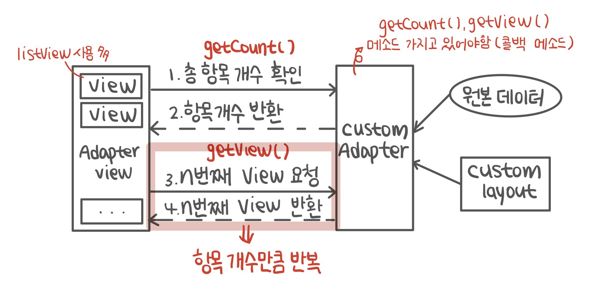
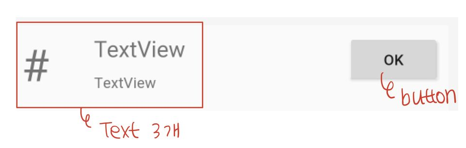

# 커스텀 어댑터 (CustomAdapter)

## 1. CustomAdapter의 사용

### ✏️  1-1. 안드로이드 기본 제공 레이아웃

- `android.R.layout.리소스ID`
    
    
    | 리소스 ID | 설명 |
    | --- | --- |
    | simple_list_item_1 | 하나의 텍스트 뷰로 구성된 레이아웃 |
    | simple_list_item_2 | 두 개의 텍스트 뷰로 구성된 레이아웃 |
    | simple_list_item_checked | 오른쪽에 체크 표시가 나타남 |
    | simple_list_item_single_choice | 오른쪽에 라디오 버튼이 나타남 |
    | simple_list_item_multiple_choice | 오른쪽에 체크 버튼이 나타남 |

### ✏️  1-2. 직접 작성한 레이아웃을 사용한 View로 Adapter View를 구성할 경우

- 새로운 View를 표현하는 레이아웃 작성
- 항목 하나의 원본 데이터를 보관하는 DTO 클래스 구현
- 추상클래스 BaseAdapter를 상속하여 커스텀 Adapter를 구현

---

## 2. CustomAdapter의 동작 개요



---

## 3. CustomAdapter의 구현

### 🔎  단계 1. ***개별 뷰 레이아웃 작성***

- Adapter View의 한 항목을 표현할 View 레이아웃
- [res] → [layout]에서 마우스 우클릭 → [New] → [Layout resource file] 선택 후 추가
    - 적당한 Layout과 파일명 선택 후 ok
    - custom_adapter_view.xml (ConstraintLayout)

        

### 🔎  단계 2. ***원본 항목 데이터 저장 클래스 작성***

- 한 항목의 값들을 저장할 자료 저장 객체
    - DTO(Data Transfer Object) 형태
    - 패키지에서 우클릭 → [New] → [Java Class] 선택

```java
public class MyData {
	// 한 항목을 표현할 데이터 저장 변수 선언
	private int _id;  // 반드시 식별 정보(_id) 추가
	private String name;
	private String phone;

	// 필요에 따라 생성자 추가 (alt + insert)
	public MyData (int _id, String name, String phone) {
		this._id = _id;
		this.name = name;
		this.phone = phone;
	}

	// getter/setter 추가 (alt + insert)
	public int get_id() { return _id; }
	public void set_id(int _id) { this._id = _id; }
	public String getName() { return name; }
	public void setName(String name) { this.name = name; }
	public String getPhone() { return phone; }
	public void setPhone(String phone) { this.phone = phone; }
}
```

### 🔎  단계 3. ***CustomAdapter 클래스 구현***

- AdapterView가 표시할 커스텀 어댑터를 생성
    - BaseAdapter 클래스의 상속 클래스 작성
    - 패키지 위에서 우클릭 → [New] → [Java Class] 선택
    - BaseAdapter 상속 (Override 메소드 재정의)
- **커스텀 어댑터의 기본 구성**
    
    ```java
    public class MyAdapter extends BaseAdapter {  // BaseAdapter 상속
    
    	private Context context;  // inflater 객체 생성 시 필요
    	private int layout;  // AdapterView 항목에 대한 layout
    	private ArrayList<Data> myDataList;  // 원본 데이터 리스트
    	private LayoutInflater layoutInflater  // inflater 객체
    
    	// inflater 객체는 내부에서 생성하면 되기 때문에 생성자 매개변수 없어도 OK
    	public MyAdapter(Context context, int layout, ArrayList<Data> myDataList) {...}
    
    	// 필수 메소드
    	@Override
    	public getCount() {...}
    
    	@Override
    	public Object getItem(int i) {...}
    
    	@Override
    	public long getItemId(int i) {...}
    
    	@Override
    	public View getView(int i, View view, ViewGroup viewGroup) {...}
    }
    ```
    
    1. 커스텀 어댑터의 주요 멤버 변수
        
        → 필요에 따라 추가 또는 삭제
        
        ```java
        private Context context;  // inflater 객체 생성 시 필요
        private int layout;  // AdapterView 항목에 대한 layout
        private ArrayList<Data> myDataList;  // 원본 데이터 리스트
        private LayoutInflater layoutInflater  // inflater 객체
        ```
        
    2. 생성자 (필수)
        
        → 기존 Adapter와 유사한 형식/순서로 매개변수 선언
        
        → 매개변수는 필요에 따라 조정
        
        ```java
        public MyAdapter(Context context, int layout, ArrayList<Data> myDataList) {
        	this.context = context;
        	this.layout = layout;
        	this.myDataList = myDataList;
        	// 인수로 받은 Context를 사용하여 Inflater 객체 준비
        	layoutInflater = (LayoutInflater) context.getSystemService (Context.LAYOUT_INFLATER_SERVICE);
        }
        ```
        
    3. 주요 메소드 
        - `getCount()`, `getItem()`, `getItemId()`
            
            ```java
            // 전체의 원본 데이터의 개수 반환
            // 반드시 구현 -> AdapterView가 표시할 View의 개수를 확인 시 호출
            @Override
            public getCount() {
            	return myDataList.size();
            }
            
            // 특정 위치의 데이터 항목 반환
            @Override
            public Object getItem(int i) {
            	return myDataList.get(pos);
            }
            
            // 특정 위치의 데이터 항목 아이디 반환
            @Override
            public long getItemId(int i) {
            	return myDataList.get(pos).get_id();
            }
            ```
            
        - `getView()`
            
            → 원본 데이터의 개수만큼 반복 호출
            
            → 리스트 뷰 순서대로 원본 데이터로 뷰를 만들어 반환
            
            ```java
            @Override
            public View getView(int i, View view, ViewGroup viewGroup) {
            	// 리스트 뷰의 position 위치를 저장 -> onClick 내부에서 사용하기 위해 상수 선언 
            	final int position = pos;  // 동작할 때 매개변수라서 사라짐 -> final 상수로 저장하여 사용
            	
            	// 전달 받은 view가 아직 미생성일 경우 -> inflater를 사용하여 layout에 해당하는 view 객체 생성
            	if (convertView == null)
            		convertView = layoutInflater.inflate(layout, viewGroupt, false);  // convertView 생성됨
            
            	// layout에 배치한 view 객체 준비 (화면 요소 준비)
            	// setFocusable(false)로 버튼뿐 아니라 모든 view가 이벤트 처리 가능하도록
            	TextView tvNo = convertView.findViewById(R.id.tvNo);
            	TextView tvName = convertView.findViewById(R.id.tvName);
            	TextView tvPhone = convertView.findViewById(R.id.tvPhone);
            	Button btnCheck = convertView.findViewById(R.id.btnCheck);
            	btnCheck.setFocusable(false);  // button만 터치 및 클릭을 처리하지 않도록
            
            	// 원본 데이터를 사용하여 값 설정 (화면 + 데이터 결합)
            	// 내부 위젯에서 이벤트 처리가 필요할 경우 이벤트 리스너 구현
            	tvNo.setText(String.valueOf(myDataList.get(position).get_id()));  // id를 문자열로 변환
            	tvName.setText(myDataList.get(position).getName());
            	tvPhone.setText(myDataList.get(position).getPhone());
            	btnCheck.setOnClickListener(new Button.OnClickListener() {  // button에 onClickListener 연결
            		@Override
            		public void onClick(View view) {
            			Toast.makeText(context, myDataList.get(position).getPhone() + " 선택", Toast.LENGTH_SHORT).show();
            		}
            	});
            
            	return convertView;  // 생성한 view 반환
            }
            ```
            

### 🔎  단계 4. ***CustomAdapter 클래스 사용***

- 구현한 CustomAdapter 사용
    
    ```java
    public class MainActivity extends AppCompatActivity {
    	private ArrayList<MyData> myDataList;
    	private MyAdapter myAdapter;
    	private ListView listView;
    
    	@Override
    	protected void onCreate(Bundle savedInstanceState) {
    		super.onCreate(savedInstanceState);
    		setContentView(R.layout.activity_main);
    
    		myDataList = new ArrayList<MyData>();
    
    		myDataList.add(new MyData(1, "홍길동", "012345"));
    		myDataList.add(new MyData(2, "전우치", "123456"));
    		myDataList.add(new MyData(3, "일지매", "234567"));
    
    		// 작성한 생성자에 맞게 호출
    		// 직접 작성한 view의 레이아웃 파일과 원본 데이터의 전달
    		myAdapter = new MyAdapter(this, R.layout.custom_adapter_view, myDataList);
    
    		listView = (ListView) findViewById(R.id.customListView);
    
    		listView.setAdapter(myAdapter);
    	}
    }
    ```
    

---

## 4. CustomAdapter 사용 시 이벤트 처리

### ✏️ 4-1. 클릭 및 롱클릭 처리는 기존 방법과 동일

```java
listView.setOnItemClickListener(new AdapterView.OnItemClickListener() {
	@Override
	public void onItemClick(AdapterView<?> adapterView, View view, int pos, long id) {
		Toast.makeText(MainActivity.this, myDataList.get(pos).getName(), Toast.LENGTH_SHORT).show();
		return true;
	}
});
```

### ✏️ 4-2. 커스텀 뷰에 버튼이 있을 경우

- 항목 아이템의 클릭/롱클릭이 동작하지 않을 수 있음 *(button, EditText 있을 경우)*
    - 버튼이 이벤트 처리를 우선적으로 수행하므로 버튼의 `focusable 속성을 false`로 지정하여 해결
        
        → XML 속성 or 코드 상에서 지정
        

---

## 5. ListView 스크롤 속도 개선

### ✏️ 5-1. Background Thread 사용

→ Thread or AsyncTask

### ✏️ 5-2. View Holder 사용

- 반복적으로 접근하는 View 객체의 findViewById() 호출을 감소시키기 위해 적용하는 설계 패턴
- 고려사항
    - ListView의 화면 상의 View 개수
        
        : 원본 데이터의 개수만큼 만들어지는 것이 아닌 화면에서 보여지는 정도의 수만 View가 생성 
        
        → 스크롤 시 화면에서 사라진 View 재사용
        
    - findViewById() 의 빈번한 호출은 성능 감소의 원인이 될 수 있음
- 뷰 레이아웃의 내부 View를 멤버로 갖는 `정적(static) 클래스를 생성`하여 반복사용 할 수 있도록 구성
    
    (Adapter 내부 클래스로 생성)
    
    ```java
    static class ViewHolder {
    	TextView textNo;
    	TextView textName;
    	TextView textPhone;
    	Button btnCheck;
    }
    ```
    
- View 객체의 setTag() 를 사용하여 저장, getTag()를 사용하여 읽어와 해당 정보를 재사용

*✔️*  *Adapter의 getView()에 적용*

```java
@Override
public View getView(int position, View convertView, ViewGroup parent) { 

	if (convertView == null) {
		convertView = layoutInflater.inflate(layout, viewGroup, false);

		// viewHolder 객체 생성 & 멤버에 객체 지정
		viewHolder = new ViewHolder();
		viewHolder.tvNo = convertView.findViewById(R.id.tvNo);
		viewHolder.tvName = convertView.findViewById(R.id.tvName);
		viewHolder.tvPhone = convertView.findViewById(R.id.tvPhone);
		viewHolder.button = convertView.findViewById(R.id.button);
		
		convertView.setTag(viewHolder);  // convertView(layout)의 setTag()를 사용하여 생성한 viewHolder 객체 저장
	} else {
		viewHolder = (ViewHolder)convertView.getTag();  // convertView가 이미 존재하는 경우 tag에 저장한 ViewHolder 객체를 getTag()를 사용하여 로딩
	} 

	// ViewHolder 객체가 저장하고 있는 View 객체의 요소에 데이터 지정
	viewHolder.tvNo.setText(String.valueOf(myDataList.get(position).get_id()));
	viewHolder.tvName.setText(myDataList.get(position).getName());
	viewHolder.tvPhone.setText(myDataList.get(position).getPhone());
	viewHolder.button.setOnClickListener(new View.OnClickListener() {
	@Override
	public void onClick(View v) {
			Toast.makeText(context, myDataList.get(position).getPhone() + "선택",   Toast.LENGTH_SHORT).show();
		}
	});
	
	return convertView;
}
```