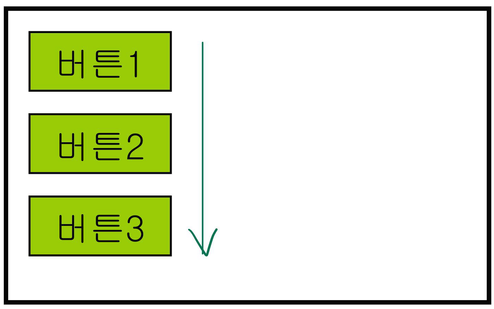
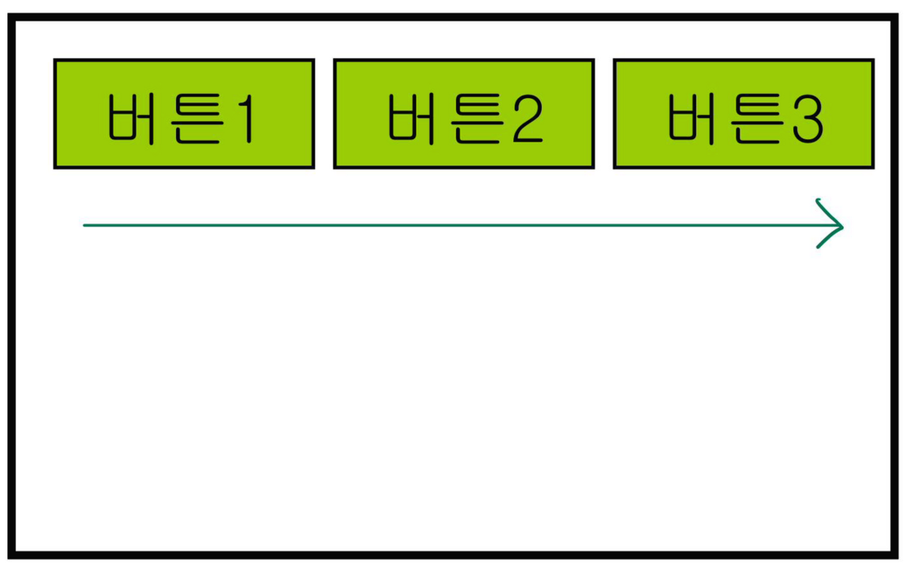
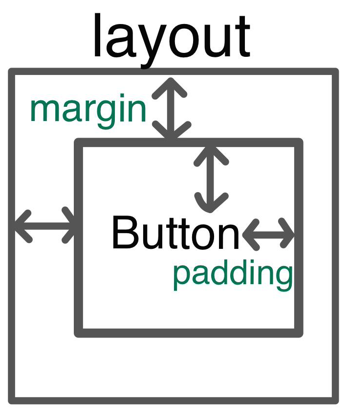
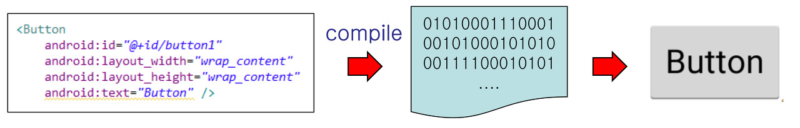

# 안드로이드 레이아웃(Layout)  
## ☝️ Layout 이란?
<br>
ViewGroup의 일종으로 다른 뷰들을 내부에 배치하는 역할을 수행한다. Layout은 내부에 위젯이나 다른 Layout을 배치함으로써 다양한 화면을 구성한다. 일반적으로 Layout은 화면 상에 직접 보이지는 않는다.
<br><br>
주요 레이아웃으로는 LinearLayout, RelativeLayout, FrameLayout, GridLayout이 있으며, 추가적인 레이아웃으로 ConstraintLayout이 있다.

<br>

--------------------------------------------------------------------

## 1. LinearLayout
>가장 간단한 레이아웃으로 가로 또는 세로의 순서대로, 즉, **_한 방향으로만 항목을 배치한다._**  

### ✏️ 1-1. 주요 속성
- **orientation** : 항목들의 나열 방식을 결정할 수 있다.  
가질 수 있는 속성 값  
  1. **vertical** : 항목을 세로(수직)으로 배치하도록 한다.<br>
  <br>
  
  <br>

  2. **horizontal** : 항목을 가로(수평)으로 배치하도록 한다.<br>
  <br>
      

<br>

- **baselineAligned** : 레이아웃에 배치한 뷰들의 아래 부분 맞춤 활성화 여부를 결정한다.
- **layout_weight** : 레이아웃의 공간을 어느 정도 비중으로 차지하느냐를 결정한다.  
_(0일 경우에는 본래의 크기, 1 이상이면 다른 뷰오 ㅏ비율에 따라 배치)_
- **layout_margin** : 레이아웃과 뷰 사이의 간격을 나타낸다.
- **padding** : 뷰와 내부 내용물 사이의 간격을 나타낸다. 

  
  <br><br>

- **gravity** : 내부 항목의 수직/수평 방향의 배치를 결정한다.  
_ex) TextView 내부의 글자 배치와 같은 내부에 담고 있는 항목의 정렬을 결정_

- **layout_gravity** : gravity와 반대로 레이아웃에 항목 자신의 수직/수평 방향 배치를 결정  
_(담겨져 있는 레이아웃 상에서의 정렬을 의미)_
```html
<Button
    android:id="@+id/button1"
    android:layout_width="wrap_content"
    android:layout_height="wrap_content"
    android:layout_gravity="center_horizontal"
    android:gravity="top"
    android:text="Button" />
```
❗️ **주의사항**  
_gravity와 layout_gravity를 사용할 때 주의해야할 점은 orientation의 vertical & horizontal 속성이 설정되어있을 경우, 이것이 더 우선시되기 때문에 layout_gravity를 사용하여도 적용이 되지 않는다._  

✔️ **해결 방안**  
_레이아웃 안에 담겨져 있는 속성이 아닌, 레이아웃을 선택 후 gravity로 배치할 수 있다._  
<br>

------------------------------------------------------------------

## 2. RelativeLayout
>뷰와 뷰를 담고 있는 레이아웃, 그리고 다른 뷰들과의 **_상대적인 관계로 배치_** 하는 레이아웃이다.
>>상대적으로 배치하기 때문에 각각 뷰들의 **_ID가 필수적으로 요구_** 된다.
<br>

------------------------------------------------------------------

## 3. FrameLayout
>레이아웃의 좌측 상단에 **_모든 뷰들을 겹쳐서 배열_** 하는 레이아웃이다.
>> 앱 실행 중 **_addView / removeView 메소드를 사용_** 하여 뷰들을 추가, 삭제한다.
<br>

------------------------------------------------------------------

## 4. 그 밖의 레이아웃
- **AbsoluteLayout** : 배치하는 View의 좌표를 절다값으로 지정하여 배치한다.  
(일반적으로 사용하지 않는 레이아웃에 속한다.)
- **TableLayout** : 표 형식으로 View를 내부에 배치한다.  
가로는 TaboleRow 개수만큼 생성, 세로는 TableRow에 포함된 View의 개수만큼 열을 생성한다.
- **GridLayout**
- **ConstraintLayout** : 뷰들을 상대적으로 배치한다.
<br>

------------------------------------------------------------------

## 5. 실행 중 레이아웃 속성 변경
### ✏️ 5-1. 변경 과정
1. **XML로 지정한 뷰 객체를 찾은 후 변경 메소들를 호출한다.**
    - **findViewById()** : XML로 정의하여 자동 변환된 뷰 요소를 찾기 위한 메소드
      - **Activity.findViewById()** : Activity 내부의 모든 뷰에서 검색
      - **View.findViewById()** : 특정 뷰 내부에서만 검색
```java
// ex) 아래 예시를 살펴보자
LinearLayout layout = (LinearLayout)findViewById(R.id.LinearLayout1);
// XML에서 지정한 id가 LinearLayout1인 레이아웃을 객체화
```  
2. 객체화 한 뷰 객체에서 속성에 해당하는 메소들를 호출한다.  
대부분의 경우 속성에 해당하는 **_getter/setter_** 속성이 존재한다.  
이를 이용하여 속성 값을 임의의 값이나 정해진 상수값으로 지정할 수 있다.  
```java
// ex) LinearLayout의 orientation을 수평으로 바꾸고 싶을 때
layout.setOrientation(LinearLayout.HORIZONTAL);
```
```java
// ex) LinearLayout의 orientation 속성을 확인하고 싶을 때
int o = layout.getOrientation();
```
<br>

------------------------------------------------------------------

## 6. 레이아웃 전개(Inflation)
>XML로 지정한 뷰는 aapt(android asset packaging tool)에 의해 컴파일되고, 이를 통해 이진 형태의 자바 객체로 변환된다.
### ✏️6-1. Infaltion이란?
Infaltion은 **XML 문서의 텍스트 형태의 뷰를 실제 자바 객체화 하는 것** 을 말한다.  
<br>
XML로 정의하면 뷰의 id가 R 폴더에 등록되며 자동으로 자바 객체로 변환한다.  
이렇게 변환된 자바 객체는 Inflation 진행 후 findViewById() 메소드를 이용하여 해당 객체를 참조한다.  
즉, R.java에 자동 기록된 정수형상수 아이디로 객체를 참조한다.  

  

### ✏️6-2. setContentView() 메소드
setContentView() 메소드는 **_View를 전달받아 Activity에 등록하는 역할을 수행_** 한다.
- setContentView()의 재정의  
각각 Activity에 등록하는 과정이 다르게 이루어짐
```java
void Activity.setContentView(int layoutResourceID); // xml 파일명
void Activity.setContentView(View view[, ViewGroup.LayoutParams params]); // view 객체
```  
1. **Layout의 resource.id를 매개변수로 전달받을 경우**  
: 내부에서 **inflation 수행 후 setContentView() 메소드를 통해 Activity에 등록** 한다.
```java
setContentView(R.layout.activity_main);
```  
2. **View 객체 (및 params 객체)를 전달받을 경우**  
: View를 **params 정보에 따라 Activity에 등록**한다.
```java
LinearLayout linear = new LinearLayout(this);
//...
setContentView(linear);
```  
<br>

### ✏️6-3. Inflation 직접 실행  
예를 들어, 앱 실행 중 화면 구성을 바꾸어야할 경우, 상황에 따라 서로 다른 화면이 구성의 교체되어야 할 때 등 필요한 경우 앱 실행 중 직접 inflation을 수행한다. 
- inflaion 관련 메소드  
```java
LayoutInflater inflater = (LayoutInflater)getSystemService(Context.LAYOUT_INFLATER_SERVICE);

// LayoutInflater = LayoutInflater.from(this);
// 여기서 this는 context 객체인 Activity 자기 자신을 의미

LinearLayout linear = (LinearLayout)inflater.inflate(R.layout.activity_main, null);

// LinearLayout linear = (LinearLayout)View.inflate(this, R.layout.activity_main, null);
// View가 갖고 있는 정적 메소드 inflate 사용

setContentView(linear);
```
<br>

------------------------------------------------------------------

## 7. Layout Parameter
> 뷰는 Layout Parameter을 통해 레이아웃 상에 배치되는 정보를 저장한다.  
각 레이아웃마다 사용하는 정보가 다르므로 레이아웃에 배치할 때 뷰와 함께 매개변수로 전달한다.

```java
LinearLayout linear = new LinearLayout(this);
linear.setOrientation(LinearLayout.VERTICAL); // orientation 속성 변경

TextView text = new TextView(this);
text.setText("TextView");

// Layout Parameter
LinearLayout.LayoutParams params = new LinearLayout.LayoutParams(
	LinearLayout.LayoutParams.WRAP_CONTENT,
    LinearLayout.LayoutParams.WRAP_CONTENT);
    
linear.addView(text, params); 

setContentView(linear);
```