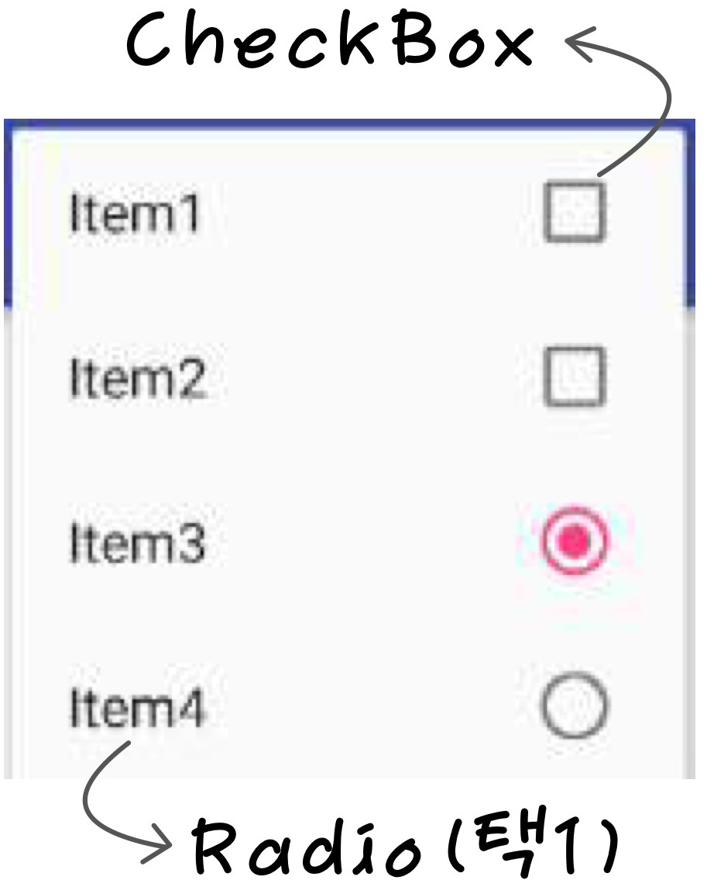

# 안드로이드 메뉴(menu)  
## 1. Android의 메뉴 사용
### ✏️ 1-1. 메뉴의 구성
> 프로그램의 기능을 계층적으로 표현한다.
- PC 환경 : 프로그램의 모든 기능
- 모바일 환경 : 환경 설정 등 부가 기능

### ✏️ 1-2. Android 메뉴의 유형
- 옵션 메뉴 (Option) : 기본 메뉴, 메뉴 버튼 클릭 시 표시한다.
- 컨텍스트 메뉴 (Context) : 요소를 롱탭 시 화면 중앙에 표시한다.
- 팝업 메뉴 : 특정 뷰 항목에 고정되어 있는 메뉴   
_(컨택스트 메뉴와의 차이 -> 팝업메뉴는 롱클릭한 것 위에 뜬다.)_

### ✏️ 1-3. 메뉴 UI 구현 방법
1. 코드로 직접 구현  
layout(XML) -> setContentView -> inflation(자동)
2. XML로 메뉴 구현 후 Inflation 수행
menu -> 직접 inflation

<br>

--------------------------------------------------------------------
## 2. Option Menu 구성 방법
### ✏️ 2-1. onCreateOptionsMenu
```java
// on이 붙으면 callback 메소드
public boolean onCreateOptionsMenu(Menu menu)
```
- 메뉴 생성을 위한 Activity 멤버 메소드이다.(Activity가 갖고 있다)
- **_메뉴 생성 필요 시 최초 1회만 호출된다._**  
(API level 11 부터는 액티비티 시작 시 자동 호출된다.)

### ✏️ 2-2. 메뉴 구성 작성 방법
- **직접 구현** : 매개변수 menu에 메뉴 항목 추가 기능을 메소드 내부에서 직접 구현한다.
- **XML 구현**  
  1. 매개변수 menu에 메뉴 XML 파일을 inflation 하여 추가한다.
  2. 주로 XML로 메뉴 작성 후 Inflation을 수행한다.

<br>

--------------------------------------------------------------------
## 3. XML을 사용한 Option Menu 작성 방법
### ✏️ 3-1. **메뉴 XML 파일**  
  : res/menu 폴더 추가 후 menu 관련 xml 파일을 추가한다  
    _ex) res/menu/menu_main.xml_

### ✏️ 3-2. **XML 메뉴 기본 구성**
```xml
<?xml version="1.0" encoding="utf-8"?>
<menu xmlns:tools="..."
    xmlns:app="..."
    xmlns:android="...">
    <item
        android:id="@+id/item01"
        android:title="Item 01" />
    <item
        android:title="Item 01">
        <menu>
            <item
                android:id="@+id/subItem01"
                android:title="Sub Item 01" />
            <item
                android:id="@+id/subItem02"
                android:title="Sub Item 02" />
        </menu>
    </item>
```
❗️ < item > 태그 내부에 < menu > 태그를 추가할 경우 하위 메뉴를 생성한다.

### ✏️ 3-3. XML 그룹 메뉴 구성  
  1. **checkableBehavior**  
   -> none(default) | single(Radio) | all(CheckBox)
   <br><br>
   <br><br>
  2. **android:checked="true"**  
    : 해당 항목이 기본적으로 선택되어 있도록 한다.
<br><br>

### ✏️ 3-4. < item >의 **_showAsAction_** 속성  
 > ActionBar 에서의 항목 표시 지정  
 - ifRoom : 공간이 있을 경우에만 표시
 - withText
 - never : menu 버튼 안에 포함
 - always : 항상 ActionBar에 포함
 - collapseActionView
  <br><br>

### ✏️ 3-5. XML로 메뉴 항목 구성 후 Inflation 수행  
  -  **_boolean getMenuInflater(Menu menu)_**  
     - Activity 클래스 멤버 메소드
     - 메뉴 정보 XML을 inflation하여 메뉴 항목 생성 후 매개변수로 전달받은 menu 객체에 추가 
```java
@Override
// 비어있는 메뉴 객체를 전달
public boolean onCreateOptionsMenu(Menu menu) {
  getMenuInflater().inflate(R.menu.menu_main, menu); // xml을 inflation 해서 menu 객체가 채워짐
  return true;
}
```
  
<br>

--------------------------------------------------------------------

## 3. Option Menu의 사용
### ✏️ 2-1. 메뉴 실행 중 메뉴 구성의 변경이 필요할 경우
- 옵션 메뉴 변경 메소드로 메뉴 변경
```java
// 메뉴가 보여질 때마다 호출된다. (Activity가 갖고 있는 메소드)
boolean onPrepareOptionsMenu(Menu menu)
```
- Activity 클래스의 멤버 메소드
- 메뉴가 보여질 때마다 호출  
_(onCreateOptionsMenu는 menu 만들어질 때 한번만 호출)_
- 실행 중 변경할 메뉴 구성을 구현  
  - **menu.clear()** : 기존 메뉴 삭제
  - **getMenuInflater.inflate(..)** : 다른 xml을 메뉴에 연결  

### ✏️ 2-1. 메뉴 실행 중 메뉴 구성의 변경이 필요할 경우
- 메뉴를 선택했을 때 호출하는 메소드
```java
// 메뉴 선택 시 동작을 위한 메소드이다.(Activity가 갖고 있는 메소드)
boolean onOptionsItemSelected(MenuItem item); // 메뉴를 누르면 해당 item이 들어간다. (id로 구분)
```
- Activity 클래스의 멤버 메소드
- item.getItemId()로 메뉴 항목 구분
- 메뉴 항목의 이벤트 처리를 완료하였을 경우 true 반환

<br>

--------------------------------------------------------------------
## 4, Option Menu 항목 선택 처리 (XML에 구현)
### ✏️ 4-1. XML 메뉴 Layout에서 메뉴 선택 시의 메소드 명 지정
- onClick 속성 
```XML
<!-- onMenuItemClick 추가(onOptionsItemSelected보다 우선시됨) -->
<item 
  android:id="@+id/action_settings"
  android:orderInCategory="100"
  android:title="Settings"
  android:onClick="onMenuItemClick"
  app:showAsAction="never" />
  ```

### ✏️ 4-2. Activity의 멤버 메소드로 해당 메소드 선언
```java
public void onMenuItemClick(MenuItem item) { // 선택한 MenuItem
  switch(item.getItemId()) {
    case R.id.action_settings:
      Toast.makeText(this, "ItemSelected!", Toast.LENGT_SHORT).show();
      break;
  }
}
```
- onOptionsItemSelected() 메소드 보다 높은 우선순위
- 호환성 고려가 필요
- ActionBar 적용 시 개별 항목 사요이 많으므로 적용이 유리