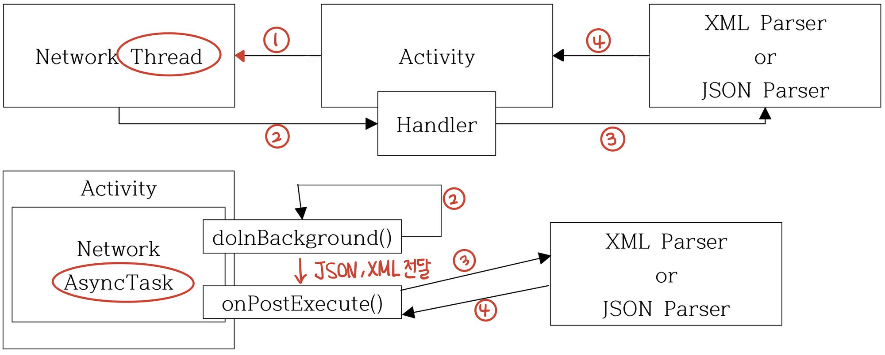
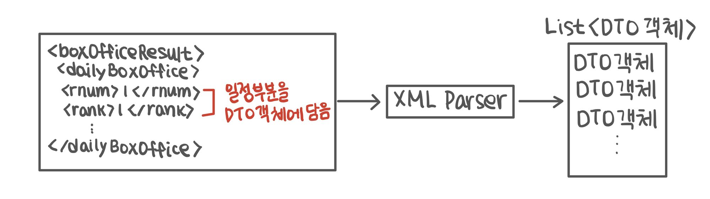

# Open API와 Parsing

## 1. **Open API 활용 기본 아키텍처**

### **✏️ 1-1. API/OpenAPI**

- **API** : 서버의 서비스, 플랫폼, O.S 기능을 이용하는 APP을 프로그래밍 하기 위한 상호작용 방법
- **OpenAPI** : 웹상에서 제공하는 서비스 API
    
    → URL 형태로 요청, 응답으로 XML, JSON (Parser로 Parsing하여 사용)
    
- **OpenAPI 활용 아키텍처**
    1. OpenAPI에 보낼 URL을 작성하여 NetworkThread 클래스 실행
    2. 해당 URL에서 받아온 XML 결과를 String으로 저장하여 반환
    3. String에 저장한 XML 내용을 XML Parser에 전달
        
        → String 대신 InputStream 전달 가능
        
    4. XML을 parsing하여 적절한 형태(배열 등)의 형태로 반환
        
          
        

## 2. **XMLPullerParser 사용**

### **✏️ 2-1. XMLPullerParser 주요 메소드**

- `**getEventType()**` : 현재 읽은 XML 문서의 이벤트 종류 반환
    - **START_DOCUMENT** : 문서의 시작 부분을 읽음
    - **END_DOCUMENT** : 문서의 마지막 부분을 읽음
    - **START_TAG** : 시작태그(<>)를 읽음 → 속성 부분 처리
    - **END_TAG** : 종료태그(</>)를 읽음
    - **TEXT** : 태그 사이의 값을 읽음
- `**next()**` : XML 문서의 다음 항목으로 이동
- `**getName()**` : 현재 읽은 태그명 또는 속성명 반환
- `**getText()**` : 현재 읽은 태그 사이의 값 반환
- `**getAttributeName(int i)**` : 현재 태그의 i번째 속성명 반환
- `**getAttributeValue(int i)**` : 현재 태그의 i번째 속성값 반환

### **✏️ 2-2. XMLPullParser 구성**

→ XML 문서만 parsing Rksmd

```java
try {
	// XMLPullParser를 생성하기 위한 factory 준비
	XMLPullParserFactory factory = XMLPullParserFactory.newInstance();
	// Factory 붙은 클래스 : 다른 객체 만들 때 사용
	// XMLPullParser 생성
	XMLPullParser mParser = factory.newPullParser();
	// String으로 전달받은 xml을 XMLPullParser에 설정
	mParser.setInput(new StringReader(xml));  // XML 문서 (InputStream 직접 전달 가능)
	 
	// 문서의 마지막이 될 때까지 읽어들이는 부분의 이벤트를 구분하여 반복 수행
	for (int eventType = mParser.getEventType();  // XML 첫 부분 가르킴
		eventType != XmlPullParser.END_DOCUMENT;  // 문서의 마지막 부분
		eventType = mParser.next()) {  // 다음 항목
		
		switch (eventType) {
			case XMLPullParser.START_DOCUMENT:  // 원하는 태그 탐색(기록 필요)
			 
			break;
			case XMLPullParser.END_DOCUMENT:
			 
			break;
			case XMLPullParser.START_TAG:
			 
			break;
			case XMLPullParser.END_TAG:
			 
			break;
			case XMLPullParser.TEXT: // 기록한 태그의 문자열 활용
			 
			break;
		}
	}
} catch (Exception e) {
	e.printStackTrace();
}
```

## 3. Parser의 구현

- XML 문서를 읽어 하나의 요소를 하나의 DTO에 저장하는 작업 반복
- 생성한 DTO는 List(ArrayList) 등의 컬렉션에 저장

  

### **✏️ 3-1. XML 문서와 DTO의 관계**

- XML 문서의 한 항목 정보 → 하나의 DTO 객체에 저장
- 한 항목이 포함한 태그(속성) → DTO 객체의 하나의 멤버변수에 저장
    
    (getter/setter 추가, 필요에 따라 toString() 재정의)
    
- 하나의 XML문서 내의 모든 항목들 => 하나의 컬렉션(ArrayList 등)에 저장

```xml
<boxOfficeResult>
...
	<dailyBoxOffice>
		<rnum>1</rnum>
		<rank>1</rank>
		<movieCd>20112207</movieCd>
		<movieNm>미션임파서블</movieNm>
		<openDt>2011-12-15</openDt>
		<scrnCnt>697</scrnCnt>
		<showCnt>3223</showCnt>
		...
	</dailyBoxOffice>
```

→ DailyBoxOffice를 통해 값 저장

```java
Public class DailyBoxOffice {
// seralizable 구현 (intent 필요)
	private long _id;  // DB 저장 시 필요
	private String rank;
	private String movieNm;
	private String openDt;
	private String movieCD;
	// (+) 생성자 필요 시 추가
	public long get_id() { 
		return _id; 
	}
	public void set_id(long _id) { 
		this._id = _id; 
	}
	...
}
```

*✔️ **Parser 구현 예*** 

```java
public class KobisXmlParser {
//    xml에서 읽어들일 태그를 구분한enum  → 정수값 등으로 구분하지 않고 가독성 높은 방식을 사용
//   해당없음, rank, movieNm, openDt, movieCd  
private enum TagType { NONE, RANK, MOVIE_NM, OPEN_DT, MOVIE_CD };     

//    parsing 대상인tag를 상수로 선언  
private final static String FAULT_RESULT = "faultResult";  
private final static String ITEM_TAG = "dailyBoxOffice";  
private final static String RANK_TAG = "rank";  
private final static String MOVIE_NAME_TAG = "movieNm";  
private final static String OPEN_DATE_TAG = "openDt";  
private final static String MOVIE_CODE = "movieCd";  

private XmlPullParser parser;  

public KobisXmlParser() {
//        xml 파서 관련 변수들은 필요에 따라 멤버변수로 선언 후 생성자에서 초기화
//        파서 준비
	XmlPullParserFactory factory = null;

//        파서 생성
	try {
		factory = XmlPullParserFactory.newInstance();
		parser = factory.newPullParser();
	} catch (XmlPullParserException e) {
		e.printStackTrace();
	}  
}  
public ArrayList<DailyBoxOffice> parse(String xml) {
	ArrayList<DailyBoxOffice> resultList = new ArrayList();
	DailyBoxOffice dbo = null;  // 태그 사이의 TEXT 값 저장
	TagType tagType = TagType.NONE;     //  태그를 구분하기 위한 enum 변수 초기화

	try {
		// String으로 전달받은 xml을 XMLPullParser에 설정
		parser.setInput(new StringReader(xml)); // 파싱 대상 지정
		int eventType = parser.getEventType(); // 태그 유형 구분 변수 준비

		while (eventType != XmlPullParser.END_DOCUMENT) { 
			switch (eventType) { 
				case XmlPullParser.START_DOCUMENT:
					break; 
				case XmlPullParser.START_TAG:
					String tag = parser.getName();
					if (tag.equals(ITEM_TAG)) {  // 아이템의 시작을 나타내는 태그 확ㅇ니 시
							// 새로운 항목을 표현하는 태그를 만났을 경우 dto 객체 생성
							dbo = new DailyBoxOffice();
					} else if (tag.equals(RANK_TAG)) {  // 관심 태그를 만났을 경우
							tagType = TagType.RANK;  // 태그 타입 저장
					} else if (tag.equals(MOVIE_NAME_TAG)) {
							tagType = TagType.MOVIE_NM;
					} else if (tag.equals(OPEN_DATE_TAG)) {
							tagType = TagType.OPEN_DT;
					} else if (tag.equals(MOVIE_CODE)) {
							tagType = TagType.MOVIE_CD;
					} else if (tag.equals(FAULT_RESULT)) {
							return null;
					}
					break;
			 case XmlPullParser.END_TAG:  // 마지막을 나타내는 태그 확인 시
					if (parser.getName().equals(ITEM_TAG)) {  // 마지막 태그가 아이템의 마지막 태그이면
						resultList.add(dbo);  // dbo를 리스트에 저장
					}
					break;
			 case XmlPullParser.TEXT:  // 태그 사이의 값이면
					switch (tagType) {  // 앞서 읽은 태그 사이의 텍스트 값을 태그 타입에 따라 구분 후
					 case RANK:
							dbo.setRank(parser.getText());  // dbo에 저장
							break;
					 case MOVIE_NM:
							dbo.setMovieNm(parser.getText());
							break;
					 case OPEN_DT:
							dbo.setOpenDt(parser.getText());
							break;
					 case MOVIE_CD:
							dbo.setMovieCD(parser.getText());
							break;
					}
					tagType = TagType.NONE;
					break;
				}
				eventType = parser.next();
			}
		} catch (Exception e) {
			e.printStackTrace();
		}

		return resultList;
  }
}
```