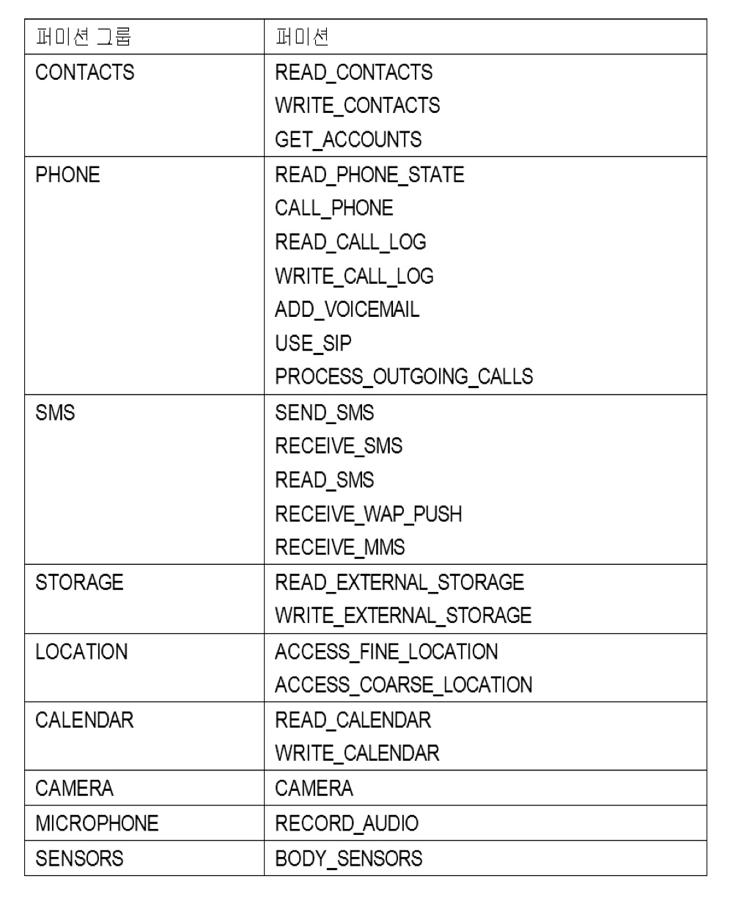

# 퍼미션(Permission)
## ☝️ 퍼미션이란?
<br>
기기의 특정 기능을 사용하기 위해서 앱이 받는 허가이다.  

퍼미션을 받지 않은 상태에서 앱이 특정 기능을 사용할 경우 예외가 발생한다. 

- 과거의 Permission 정책  
  1. 앱에 지정만 하면 자유롭게 permissin 획득이 가능했다.
  2. 설치 시 Permission에 대한 안내를 하고, 설치 이후에는 사용자가 변경할 수 없었다.

- **새로운 Permission 정책** (Android 6.0 이후)  
  1. 보안 위험에 따라 Permission 종류를 그룹으로 분류한다.
  2. 중요한 Permission은 **실행 중 Permission 사용 여부를 사용자가 결정한다.**  
  <br>
  

<br>

--------------------------------------------------------------------

## 1. 실행 중 퍼미션 확인 및 추가
### ✏️ 1-1. 네트워크 퍼미션
> 필요한 퍼미션을 AndroidManifest에 추가한다.

- **네트워크 퍼미션**
  - _ACCESS_FINE_LOCATION_
  - _ACCESS-COARSE_LOCATION_  
- **필요한 위치에서 퍼미션 확인** _(네트워크 사용 전)_
```java
// 퍼미션들 중 하나라도 허가가 되지 않으면 퍼미션 확인을  요청한다.
if (ActivityCompat.checkSelfPermission(this, Manifest.permission.ACCESS_FINE_LOCATION) != PackageManager.PERMISSION_GRANTED
 && ActivityCompat.checkSelfPermission(this, Manifest.permission.ACCESS_COARSE_LOCATION != PackageManager.PERMISSION_GRANTED) {
     // 퍼미션 확인 요청 부분
     ActivityCompat.requestPermissions(this,
        new String[] {Manifest.permisson.ACCESS_FINE_LOCATION, Manifest.permission.ACCESS_COARSE_LOCATION}, 
        MY_PERMISSION_REQUEST_LOCATION); 
        // 퍼미션 요청 식별 코드 (Static int requestCode = 100; 으로 선언)
}
```
- **퍼미션 결과 확인**
```java
// Activity 내부에 작성
@Overide
public void onRequestPermissionResult(int requestCode, @NonNull String[] permissions, @NonNull int[] grantResults) {
    // 승인 여부를 grantResults(정수 배열)로
    switch (requestCode) {
        case MY_PERMISSIONS_REQUEST_ACCESS_LOCATION:
            if (grantResults.length > 0
                && grantResults[0] == PackageManager.PERMISSION_GRANTED
                && grantResults[1] == PackageManager.PERMISSION_GRANTED) {
                    Toast.makeText(this, "Permission was granted!!", Toast.LENGTH_SHORT).show();
            } else {
                Toast.makeText(this, "Permission was denied!!", Toast.LENGTH_SHORT).show();
            }
    }
}
```
_✔️ 사용자의 퍼미션 설정 정보는 내부에 저장되어 유지된다._
