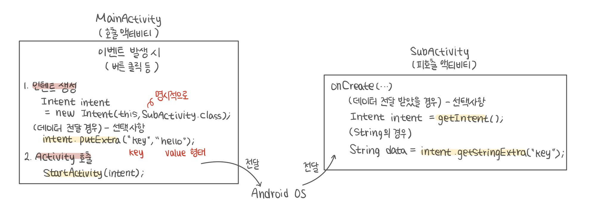

# 안드로이드 데이터베이스 (SQLite)

## ☝️ SQLite

> 클라이언트 어플리케이션에 주로 사용하는 경량 내장형 DBMS
> 

→ 관계형 데이터베이스

- 기기의 앱에서 자료를 영구로 저장해야 할 경우 적용
    - 휴대폰 내부에 파일로 DB가 만들어짐
    - 라이브러리 형태로 호출하여 사용
        
        (클래스 import)
        

    

---

## 1. DB 사용 절차

1. **SQLiteOpenHelper 상속 클래스 작성**
    
    ```java
    class MyDBHelper extends SQLiteOpenHelper{
    	MyDBHelper()  // 생성자
    	onCreate()  // 테이블 생성
    	onUpgrade()  // DB 수정이 필요할 경우
    }
    ```
    
2. **helper 객체 생성**
    
    ```java
    MyDBHelper helper = new MyDBHelper(this)
    ```
    
3. **helper 사용하여 SQLiteDatabase 객체 획득**
    
    ```java
    SQLiteDatabase myDB = helper.getWritableDatabase() // insert, update, delete
    SQLiteDatabase myDB = helper.getReadableDatabase() // select
    ```
    
4. **SQLiteDatabase 객체를 사용하여 Query 수행**
    
    ```java
    // 메소드 사용 방식
    myDB.insert()  // 자료 저장 시
    myDB.upgrade()  // 자료 수정 시
    myDB.delete()  // 자료 삭제 시
    myDB.query()  // 자료 검색 시
    
    // SQL 문 직접 작성 방식
    myDB.execSQL()  // insert, upgrade, delete 사용 시
    myDB.rawQuery()  // select 사용 시
    ```
    
5. **helper 객체(및 관련 객체) Close 수행**
    
    ```java
    helper.close()  // Cursor을 사용하였을 경우 Cursor.close() <- select 사용 시
    ```
    

---

## 2. DB 준비 - SQLiteOpenHelper 클래스

> 데이터베이스를 편리하게 사용할 수 있도록 도와주는 클래스 → 상속하여 사용
> 
- 데이터베이스 저장 파일 생성 (DB 파일)
- 테이블 생성
- 테이블 업그레이드, 기본 샘플 데이터 추가 등
- SQLiteDatabase 객체 제공
    
    → DB를 App에서 사용할 수 있도록
    

### ✏️ 2-1. 필수 재정의 메소드

- `생성자` : 사용할 DB 파일 명 및 DB 버전을 지정
- `onCreate()`
    - 사용할 테이블을 SQL을 사용하여 생성
    - 샘플이 필요할 경우 테이블 생성 후 샘플 추가 문장 작성
- `onUpgrade()`
    
    : 테이블 구조를 변경해야 할 필요가 있을 때 사용
    
    → 특별히 재정의하지 않아도 무방
    

### ✏️ 2-2. SQLiteOpenHelper 상속 클래스 작성

```java
public class FoodDBHelper extends SQLiteOpenHelper {
	final static String TAG = "FoodDBHelper"; // LOG 출력을 위해
	final static String DB_NAME = "foods.db";

	// 테이블 명, 컬럼 명은 final 상수로 선언 -> 외부에서 접근할 수 있도록
	public final static String TABLE_NAME = "food_table";
	public final static String COL_ID = "_id";
	public final static String COL_FOOD = "food";
	public final static String COL_NATION = "nation";
	public final static String COL_READ = "read"; // 모두 읽기 위해 추가

	public FoodDBHelper(Context context) {  
		super(context, DB_NAME, null, 1);
	}

	@Override
	public void onCreate(SQLiteDatabase db) {
		// 최초로 getWritableDatabase() 혹은 getReadableDatabase() 호출 시 1회만 실행
		// 테이블 생성 시 주키(primary key)는 반드시 _id로 선언 -> 데이터 추가 시 설정 안해도 됨  
		String sql = "CREATE TABLE " + TABLE_NAME+ " ( " + COL_ID + " integer primary key autoincrement, "
								+ COL_FOOD + " text, " + COL_NATION + " text, " + COL_READ + " text)";  
		Log.d(TAG, sql);  
		db.execSQL(sql);
	}

	// DB 테이블 구조를 변경할 필요가 있을 때 사용
	@Override
	public void onUpgrade(SQLiteDatabase db, int oldVersion, int newVersion) {
	  db.execSQL("DROP TABLE IF EXISTS " + TABLE_NAME);
	  onCreate(db);
	}

}
```

<aside>
💡 ***Helper 변경 → 스마트폰 앱 제거 → 재실행***

(onCreate이 최초 1회만 호출되기 때문에 앱 제거 안하면 변경 내용 반영 X)

</aside>

### ✏️ 2-3. Helper 객체 생성

> DB를 사용할 부분에서 객체 생성
> 
- Helper 객체 생성 시 생성자에 의해 DB 파일이 안드로이드 내부저장소에 생성
    - 실기기는 보안 문제로 폴더 외부 접근이 안되므로 에뮬레이터 상에서만 확인 가능
    - [View] → [Tools Window] → [Device File Explorer]
        - 에뮬레이터 선택 후 [File Explorer] 선택

---

## 3. DB 사용 - SQLiteDatabase 클래스

> Helper 클래스에 의해 관리되는 데이터베이스 클래스
> 
> 
> → Query 수행
> 
- Helper 클래스를 사용하여 획득
    1. **읽기 전용 *(select)***
        
        ```java
        SQLiteDatabase myDB = myDBHelper.getReadableDatabase()
        ```
        
    2. **읽기/쓰기 겸용 *(insert/update/delete)***
        
        ```java
        SQLiteDatabase myDB = myDBHelper.getWritableDatabase()
        ```
        
- **SQL을 직접 사용**하거나 **관련 메소드를 사용**하여 Query 수행
- 모든 작업 수행 후 Helper 객체를 통해 **반드시 close()**하여 종료

### ✏️ 3-1. SQLiteDatabase  Query

🔎   **데이터 삽입** → `**insert()**` or `**execSQL()**`

1. ***ContentValues 객체 생성 후 입력할 데이터 값 설정 후 insert 메소드 사용***
    
    ```java
    ContentValues row = new ContentValues();
    
    // 데이터 준비
    row.put("food", "된장찌개");  // 컬럼명, 삽입할 값
    row.put("nation", "한국");
    
    // 데이터 삽입
    // table명, nullColumnHack, ContentValues(데이터를 담고 있는 객체)
    db.insert(FoodDBHelper.TABLE_NAME, null, row);  
    ```
    
2. ***execSQL 메소드를 사용하여 SQL 직접 수행***
    
    ```java
    // 띄어쓰기 중요
    db.execSQL("INSERT INTO " + FoodDBHelper.TABLE_NAME + " VALUES (NULL, '된장찌개', '한국');");
    ```
    

🔎   **데이터 수정** → `**update()**` or `**execSQL()**`

1. ***ContentValues 객체 생성 후 입력할 데이터 값 설정 후 update 메소드 사용***
    
    ```java
    ContentValues row = new ContentValues();
    
    // 데이터 준비
    row.put("nation", "한국"); // 컬럼명, 삽입할 값
    // 조건 여러개일 경우 : "food=? and nation=?"
    String whereClause = "food=?";  // null일 경우 전체 행 삭제
    // 조건 여러개일 경우 : new String[] {"된장찌개", "한국"};
    String[] whereArgs = new String[] {"된장찌개"};
    
    // table명, contentValues, 조건, 조건 값 배열
    db.update(FoodDBHelper.TABLE_NAME, row, whereClause, whereArgs);  
    ```
    
2. ***execSQL 메소드를 사용하여 SQL 직접 수행***
    
    ```java
    // 띄어쓰기 중요
    db.execSQL("UPDATE " + FoodDBHelper.TABLE_NAME + " SET nation='한국' WHERE food='된장찌개';");
    ```
    

🔎   **데이터 삭제** → `**delete()**` or `**execSQL()**`

1. ***조건문 지정 후 delete() 수행***
    
    ```java
    
    String whereClause = "food=?"; 
    String[] whereArgs = new String[] {"된장찌개"};
    
    // table명, 조건, 조건 값 배열
    db.delete(FoodDBHelper.TABLE_NAME, whereClause, whereArgs);  
    ```
    
2. ***execSQL 메소드를 사용하여 SQL 직접 수행***
    
    ```java
    // 띄어쓰기 중요
    db.execSQL("DELETE FROM " + FoodDBHelper.TABLE_NAME + " WHERE food='된장찌개';");
    ```
    

🔎   **데이터 검색** → `**query()**` or `**rawQuery()**`

*✔️* **Cursor(데이터 반환 집합에 대한 레퍼런스) 값 반환**

1. ***조건문 지정 후 query() 수행***
    
    ```java
    
    String[] columns = {"_id", "food", "nation"};  // 모든 컬럼값이 필요할 때는 NULL
    String selections = "food=?";
    String[] selectArgs = new String[] {"된장찌개"};
    
    // table명, 읽어올 컬럼명, 조건, 조건 값 배열, groupBy, having, orderBy, limit
    Cursor cursor = db.query(FoodDBHelper.TABLE_NAME, columns, selection, selectArgs,
    												null, null, null, null};
    ```
    
2. ***rawQuery 메소드를 사용하여 SQL 직접 수행***
    
    ```java
    // 띄어쓰기 중요
    Cursor cursor = db.execSQL("SELECT _id, food, nation FROM " + FoodDBHelper.TABLE_NAME + " WHERE food='된장찌개';");
    ```
    
3. ***Cursor***
    - select 문에 의해 반환한 레코드의 집합을 지정
    - `moveToNext()` : 이동할 레코드가 있으면 true, 없으면 false
    - get타입 (column 순서)를 사용하여 값을 읽어옴
    
    ```java
    String result = "";
    // 결과를 MyItem 객체에 저장 후 List에 저장할 경우
    // ArrayList<FOOD> list = new ArrayList<FOOD>();
    
    while ( (cursor.moveToNext())) { // 이동할 레코드가 있으면 true
    	result += cursor.getInt((cursor.getColumnIndex(FoodDBHelper.COL_ID))) + " : ";
    	result += cursor.getString((cursor.getColumnIndex(FoodDBHelper.COL_FOOD))) + " : ";
    	result += cursor.getString((cursor.getColumnIndex(FoodDBHelper.COL_NATION))) + "\n";
    
    	// 결과를 객체에 저장할 경우
    	// FOOD food = new FOOD(id, food, nation);
    	// list.add(food);
    }
    
    cursor.close();
    ```