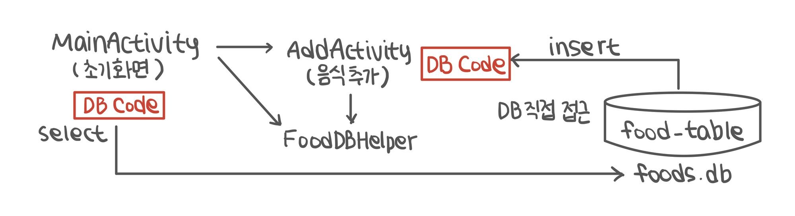
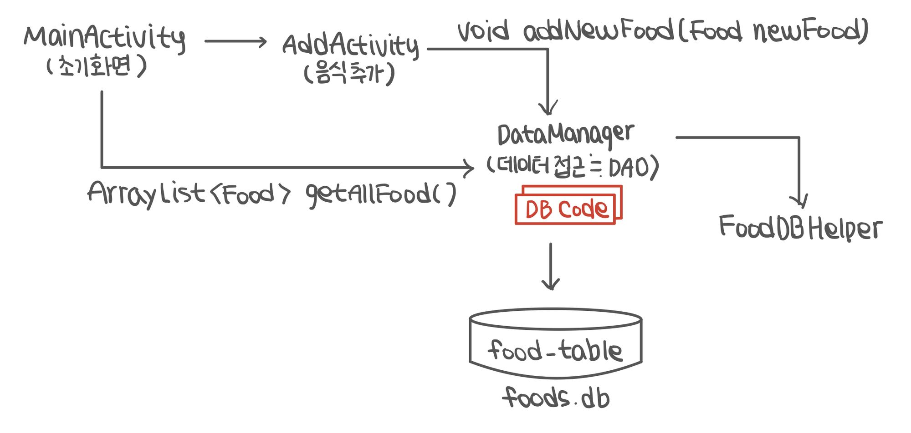

# 데이터베이스 ListView 적용

## 1. **ListView와 DB의 연결**

### **✏️ 1-1. DB의 내용을 ListView에 출력할 때**

- ListView에 연결할 ArrayAdapter 또는 커스텀 Adapter에 ArrayList<DTO> 형태의 배열을 전달
- 새로운 데이터 입력, 수정, 그리고 삭제 시 문제 발생
    - 동일한 데이터가 ArrayList와 DB에 존재 (변경 시 둘 다 수정 필요)
        
        → DB를 갱신할 경우 ArrayList의 갱신도 필수
        
    
    ```java
    ListView listView;
    ArrayAdapter adapter;
    ArrayList<Food> foodList = null;
    FoodDBHelper dbHelper;
    
    @Override
    protected void onCreate(Bundle savedInstanceState) {
    	super.onCreate(savedInstance);
    	setContentView(R.layout.activity_main);
    	
    	listView = findViewById(R.id.listView);
    	foodList = new ArrayList<Food>();
    	
    	dbHelper = new FoodDBHelper(this);
    	SQLiteDatabase db = dbHelper.getReadableDatabase();
    	
    	Cursor cursor = db.rawQuery("SELECT * FROM " + FoodDBHelper.TABLE_NAME, null);
    	
    	while (cursor.moveToNext()) {
    		long id = cursor.getInt(cursor.getColumnIndex(FoodDBHelper.COL_ID));
    		String food = cursor.getString((cursor.getColumnIndex(FoodDBHelper.COL_FOOD));
    		String nation = cursor.getString((cursor.getColumnIndex(FoodDBHelper.COL_NATION));
    		foodList.add(new Food (id, food, nation) );  // ArrayList 복사본
    	}
    	
    	cursor.close();
    	deHelper.close();
    	
    	adapter = new ArrayAdapter(this, android.R.layout.simple_list_item_1, foodList);
    	listView.setAdapter(adapter);
    }
    ```
    

### **✏️ 1-2. 새로운 Food를 추가하고 MainActivity로 돌아왔을 때**

- onCreate()은 액티비티 생성 시에만 호출하므로 MainActivity가 다시 보여질 때는 실행하지 않음
    
    → 새로운 데이터가 반영되지 X
    

### **✏️ 1-3. 보완책**

- onCreate()이 아닌 매번 화면이 보여지기 직전에 실행하는 **onResume() 데이터를 읽어오도록** 구성
- 전체 데이터를 DB에서 읽어와 foodList를 갱신하는 부분을 메소드화
    
    → 수행 후 `adapter.notifyDataSetChanged()` 호출
    

```java
@Override
protected void onCreate(Bundle savedInstanceState) {
	super.onCreate(savedInstance);
	setContentView(R.layout.activity_main);
	
	listView = findViewById(R.id.listView);
	foodList = new ArrayList<Food>();
	dbHelper = new FoodDBHelper(this);
	adapter = new ArrayAdapter<Food>(this, android.R.layout.simple_list_item_1, foodList);
	listView.setAdapter(adapter);
}

@Override
protected void onResume() {  // 화면이 보여지기 직전에 호출됨
	super.onResume();
	readAllFoods();  // 리스트 뷰에 새로운 데ㅣ터를 설정한 후 리스트 뷰 갱신
	adapter.notifyDataSetChanged();
}

private void readAllFoods() {
	foodList.clear();  // DB 테이블에서 모든 레코드를 다시 읽어오므로 foodList를 비움

	SQLiteDatabase db = dbHelper.getReadableDatabase();ß
	Cursor cursor = db.rawQuery("SELECT * FROM " + FoodDBHelper.TABLE_NAME, null);
	
	while (cursor.moveToNext()) {
		long id = cursor.getInt(cursor.getColumnIndex(FoodDBHelper.COL_ID));
		String food = cursor.getString((cursor.getColumnIndex(FoodDBHelper.COL_FOOD));
		String nation = cursor.getString((cursor.getColumnIndex(FoodDBHelper.COL_NATION));
		foodList.add(new Food (id, food, nation) );  // ArrayList 복사본
	}
	
	cursor.close();
	deHelper.close();
}
```

## 2. 데이터베이스 관리 클래스

### **✏️ 2-1.**



1. 데이터베이스 접근을 각각의 activity에서 제어
    - Database Helper 객체를 멤버로 생성
2. 데이터베이스 사용이 필요한 activity가 있을 때마다 다음 작업 수행
    - 데이터베이스 접근이 필요한 부분에 관련 코드 작성

*✔️  데이터베이스 코드가 activity마다 분산되어 있으므로 데이터베이스 관련 activity를 모두 수정해야 함*

*✔️  activity의 본 역할은 화면 제어이므로 역할의 분할 필요*

### **✏️ 2-2.**



1. 데이터베이스 접근을 DataManager에서 제어
    - Database Helper 객체를 멤버로 생성
2. 데이터베이스 사용이 필요한 activity가 있을 때마다 다음 작업 수행
    1. 데이터베이스 필요한 activity에 DataManager 객체를 멤버로 생성
    2. DataManager 클래스에 필요한 메소드 추가
    3. activity에서 DataManager의 메소드를 호출
    4. activity의 onPause()에서 DataManager의 close 관련 메소드 호출 필요