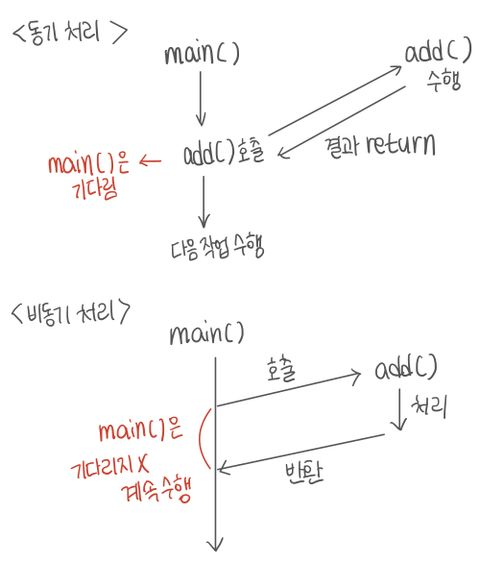
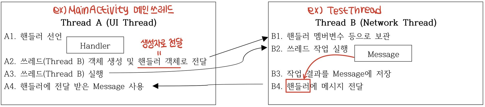

# Thread와 AsyncTask 사용

## **☝️ 비동기 처리 (Asynchronous Processing)**

- **필요성**
    - 작업시간이 긴 작업 또는 기기 외부의 요소와 상호작용할 경우 시간 지연 발생할 수 있음
    - 사용자 UI를 처리 쓰레드(Main Thread)에서 해당 사항이 발생할 경우 ANR(Application Not Responding)이 발생
    
    ex) 대용량 DB 접근, 네트워크 사용 등
    
- **해결 방안**
    - 별도의 쓰레드에서 작업 시간이 긴 작업을 수행
    
    1.  Thread 클래스에서 네트워크 작업 수행 (기초)
    2. AsyncTask 클래스에서 네트워크 작업 수행 (기본)
    

=

---

## 1. **Thread 클래스 사용**

### **✏️ 1-1. Thread 사용 방법**

- ***Thread 클래스를 상속 후 재정의***하여 실행
    1. Thread 상속 클래스 선언
        
        ```java
        class MyThread extends Thread {
        	public void run() {
        		// 다중 작업할 내용
        	}
        }
        ```
        
    2. 쓰레드 실행
        
        ```java
        MyThread myThread = new MyThread();
        // myThread.setDaemon(true); 
        myThread.start();  // 새로운 쓰레드 만들어져서 수행 (아래코드는 계속 진행)
        ```
        
- ***Runnable 인터페이스를 구현 후 Thread 클래스에 전달***하여 실행
    
    → 다중 상속 가능 (interface)
    
    1. Runnable 구현 클래스 선언
        
        ```java
        class MyRunnable implements Runnable {
        	public void run() {
        		// 다중 작업할 내용
        	}
        }
        ```
        
    2. 쓰레드 실행
        
        ```java
        // Runnable 구현 객체 생성 후 Thread 생성자의 매개변수로 전달하여 실행
        MyRunnable myRunnable = new MyRunnable();  Thread thread = new Thread(myRunnable);
        thread.start();
        ```
        

### **✏️ 1-2. Thread 사이의 통신**

- 메인 쓰레드의 UI 항목을 다른 쓰레드에서 직접 접근할 수 없음
- 네트워크 기능을 분리하였으므로 수신한 데이터를 UI 쓰레드에 전달할 수 있는 방법 필요

### **✏️ 1-3. Handler**

- **Handler 사용**
    - 쓰레드 사이에 메시지(Message 클래스)와 Runnable 객체를 주고 받을 수 있는 통신 메커니즘
    - 핸들러는 자신을 생성한 쓰레드에 속하여 다른 쓰레드에서 생성한 메시지를 전달 받을 수 있음
        1. 일반적으로 다른 쓰레드 객체 생성 시 생성자의 매개변수로 핸들러 객체 전달
        2. Message 객체의 정보 저장 후 핸들러에 저장하여 쓰레드 사이의 정보 교환 수행
- **Handler 사용 절차**
    
    
    
- **Message 클래스**
    - Handler을 통해 데이터를 전달하는 용도의 클래스
    - 생성 시 직접 `new Message()`, `Message.obtain()`, Handler.obtainMessage() 등을 사용
    - **Message 주요 멤버 변수** (public 이므로 직접 사용)
        1. ***int what*** = 메시지의 의미를 저장할 때 사용 (0 : 처리 실패, 1 : 처리 성공)
        2. ***int arg1/int arg2*** = 메시지의 정수형 정보
        3. ***Object obj*** = 정수형 이외의 객체를 결과로 보낼 때 사용
- **Handler의 메시지 전달 메소드** *→ handleMessage(...) 수행*
    1. *boolean sendEmptyMessage (int what)* : what 값만을 간단하게 전달하고 싶을 때 사용
    2. *boolean sendMessage (Message msg)* : 일반적인 메시지 전달 시 사용
    3. *boolean sendMessageAtFromtOfQueue* : 우선적으로 처리하고자 하는 메시지 전달 시 사용

---

## 2. **AsyncTask 클래스 사용**

> Thread와 Handler의 사용 대신 UI 상에서 간단하게 비동기 작업을 수행할 수 있도록 도와주는 클래스
> 
> 
> Thread 클래스와 달리 내부 메소드들에서 UI 요소를 직접 접근하여 사용할 수 있음
> 
> → dolnBackground() 메소드 제외
> 

### **✏️ 2-1. AsyncTask<Param1, Param2, Param3>을 상속**

1. **Param1** : AsyncTask에 전달할 자료형 → *input*
2. **Param2** : 작업 진행 상태를 표시할 자료형 → *progress*
3. **Param3** : AsyncTask 수행 후 반환할 결과의 자료형 → *output*
- 기본 자료형이 아닌 ***클래스 형으로 전달***  → int(X), Integer(O)
- 전달 값이 필요 없을 경우 Void

### **✏️ 2-2. AsyncTask 상속 및 구현**

```java
// String : 네트워크 url / Integer : 진행상태 / String : html 결과
public class MyAsyncTaskClass extends AsyncTask<String, Integer, String> {
	@Override 
	// 선택 – 작업 수행 전 초기화 작업
	protected void onPreExecute() { }
	
	@Override 
	// 필수 – 비동기 방식으로 수행하여야 할 작업 지정 (ex. 네트워크) params : 전달받은 값
	protected String dolnBackground(String... inputParams) { // 외부 UI 요소 접근 불가
		return null;
	}
	 
	@Override 
	// 선택 – 작업 완료 후 수행하여야 할 작업
	protected void onPostExecute(String result) { }
	 
	@Override 
	// 선택 – 작업 진행 중 진행 상태를 표시(dolnBackground에서 publishProgress(..) 호출 시 실행)
	protected void onPostExecute(Integer... values) { }
	 
	@Override 
	// 선택 – UI 측에서 cancel() 실행 시 호출되어 작업 중단
	protected void onCancelled() { }
	 
	@Override 
	// 선택 – UI 측에서 cancel() 실행 시 호출되어 작업 중단
	protected void onCancelled(String result) { }
}
```