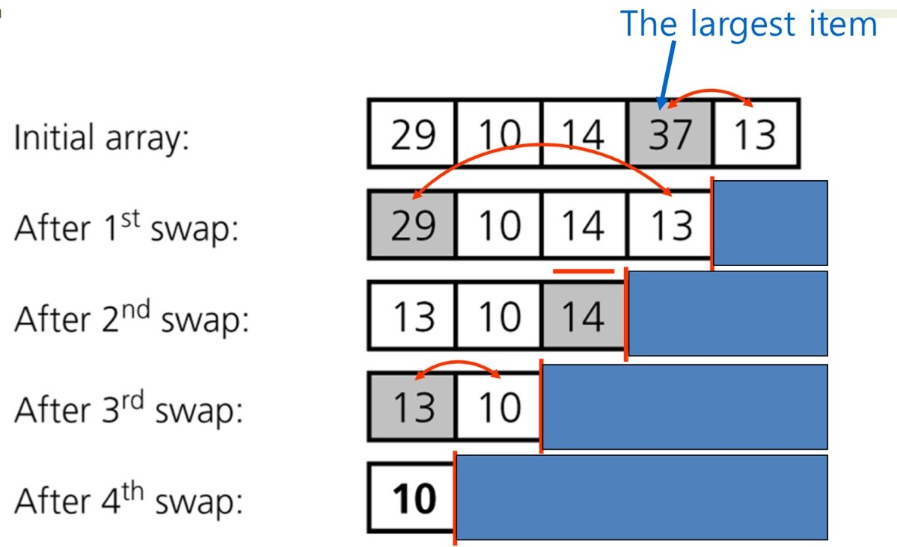
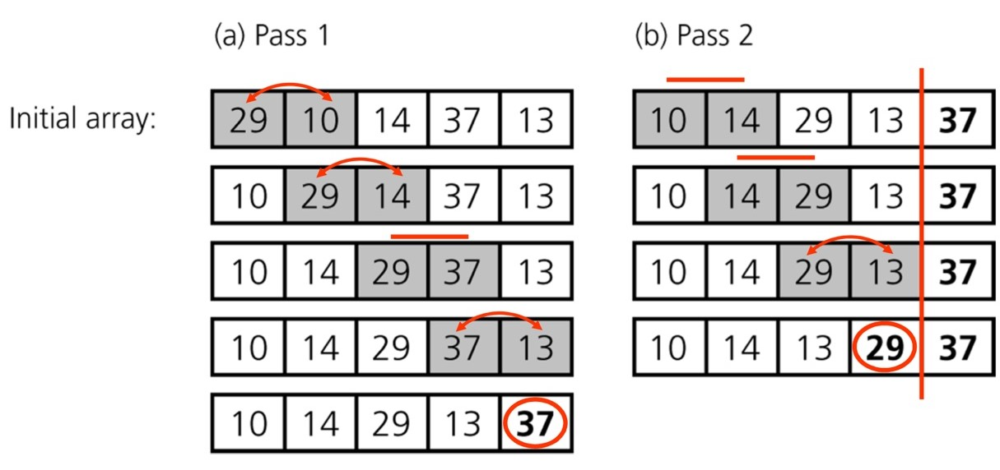
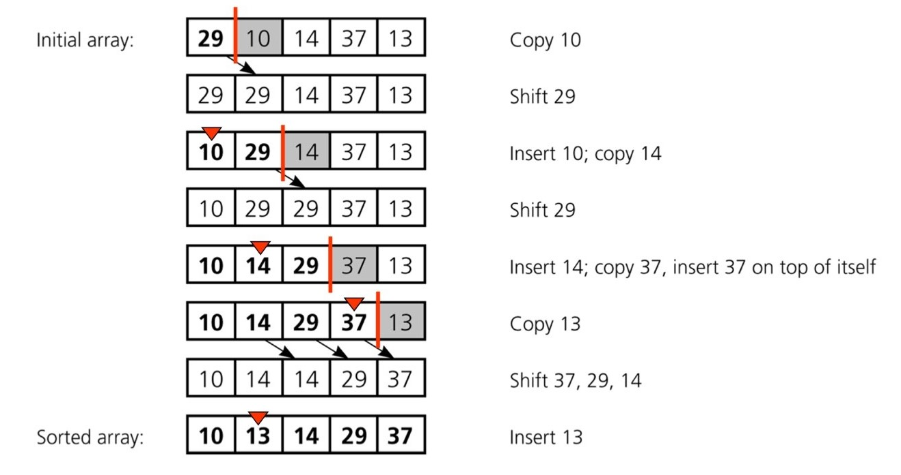

# 정렬 알고리즘
## ☝️ Selection Sort

1. 각 루프마다  
    -> 최대 원소를 찾는다.
    -> 최대 원소와 맨 오른쪽 원소를 교환한다.
    -> 맨 오른쪽 원소를 제외한다.
2. 하나의 원소만 남을 때까지 위의 루프를 반복한다.

  
<br><br>  

### ✏️ **알고리즘**
> 시간복잡도 T(n) = (n - 1) + (n - 2) + ... + 2 + 1 = **O(n^)**
```java
selectionSort(A[], n) // 배열 A[1 ... n]을 정렬한다.
{
    for last <- n downto 2 { // (n - 1)회 반복
        // (n - 1), (n - 2), ... , 2, 1회 반복
        A[1...last] 중 가장 큰 수 A[k]를 찾는다; 
        A[k] <-> A[last]; // A[k]와 A[last]의 값을 교환
    }
}
```
<br>  

------------------------------------------------------------------

## ☝️ Bubble Sort
<br>
  
<br><br>

### ✏️ **알고리즘**
> 시간복잡도 T(n) = (n - 1) + (n - 2) + ... + 2 + 1 = **O(n^)**
```java
bubbleSort(A[], n) // 배열 A[1 ... n]을 정렬한다.
{
    for last <- n downto 2 { // (n - 1)회 반복 
        // 각각 (n - 1), (n - 2), ... , 2, 1회 반복
        for i <- 1 to last - 1
            // 교환 (상수시간 작업)
            if (A[i] > A[i + 1]) then A[i] <-> A[i + 1]; 
    }
}
```

<br>  

------------------------------------------------------------------

## ☝️ Insertion Sort

- n = 5일 때 4번 insertion  
    -> n일 때 (n - 1)회 insertion  

<br>
  
<br><br>

### ✏️ **알고리즘**
> 최악(평균)의 경우 시간복잡도 T(n) = (n - 1) + (n - 2) + ... + 2 + 1 = **O(n^)**
```java
insertionSort(A[], n) // 배열 A[1 ... n]을 정렬한다.
{
    for i <- 2 to n {
        A[1...i]의 적당한 자리에 A[i]를 삽입한다
    }
}
```
#### 1. _앞부터 정렬_
```c
insertionSort(int* A, n)
{
    int i;
    // (n - 1)회 반복
    for (i = 1; i < n; i++)
    {
        int j = 0;
        int m, k; 
        // A[i]가 들어갈 자리를 찾음
        for (j = 0; j < i; j++)
            if (A[j] > A[i]) break; // j가 들어갈 인덱스
        m = A[i];

        // 뒤 원소를 하나씩 뒤로 미룸
        for (k = i; k > j; k--)
            A[k] = A[k - 1];
        A[j] = m;
    }
}  
```
> 시간복잡도 T(n) = 1 + 2 + 3 + ... + (n - 1)   
= 1/2 * (n^ - n) = **O(n^)**

#### 2. _뒤부터 정렬_
```c
insertionSort(int* A, n)
{
    int i;
    // (n - 1)회 반복
    for (i = 1; i < n; i++)
    {
        int j = 0;
        int m, k; 
        // A[i]가 들어갈 자리를 찾음
        for (j = i - 1; j >= i; j--)
            if (A[j] > A[i]) break; // j가 들어갈 인덱스
        m = A[i];

        // 뒤 원소를 하나씩 뒤로 미룸
        for (k = i; k > j; k--)
            A[k] = A[k - 1];
        A[j] = m;
    }
}  
```
> input이 이미 정렬되어 있다면 **O(n)** 에 수행됨