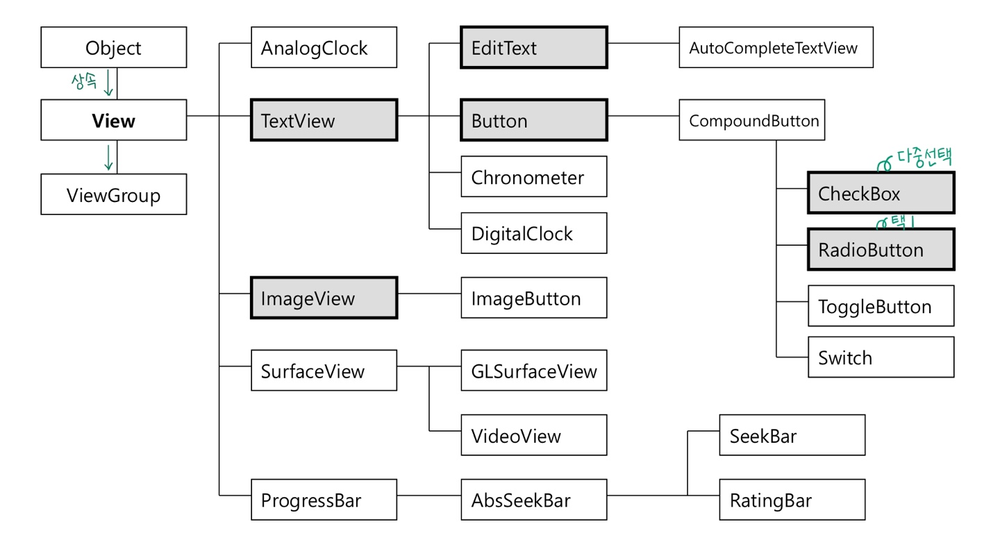
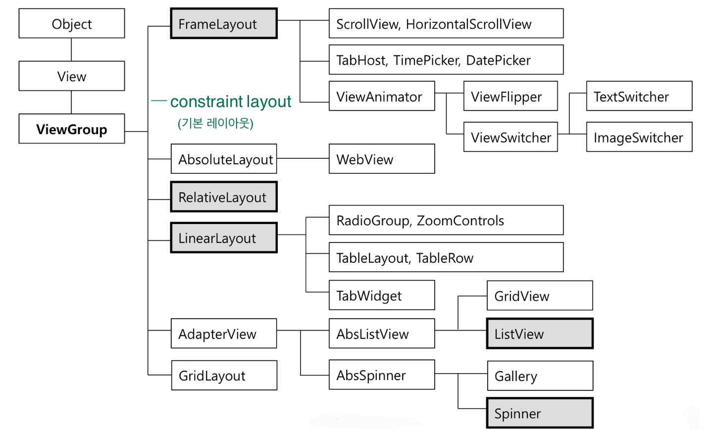
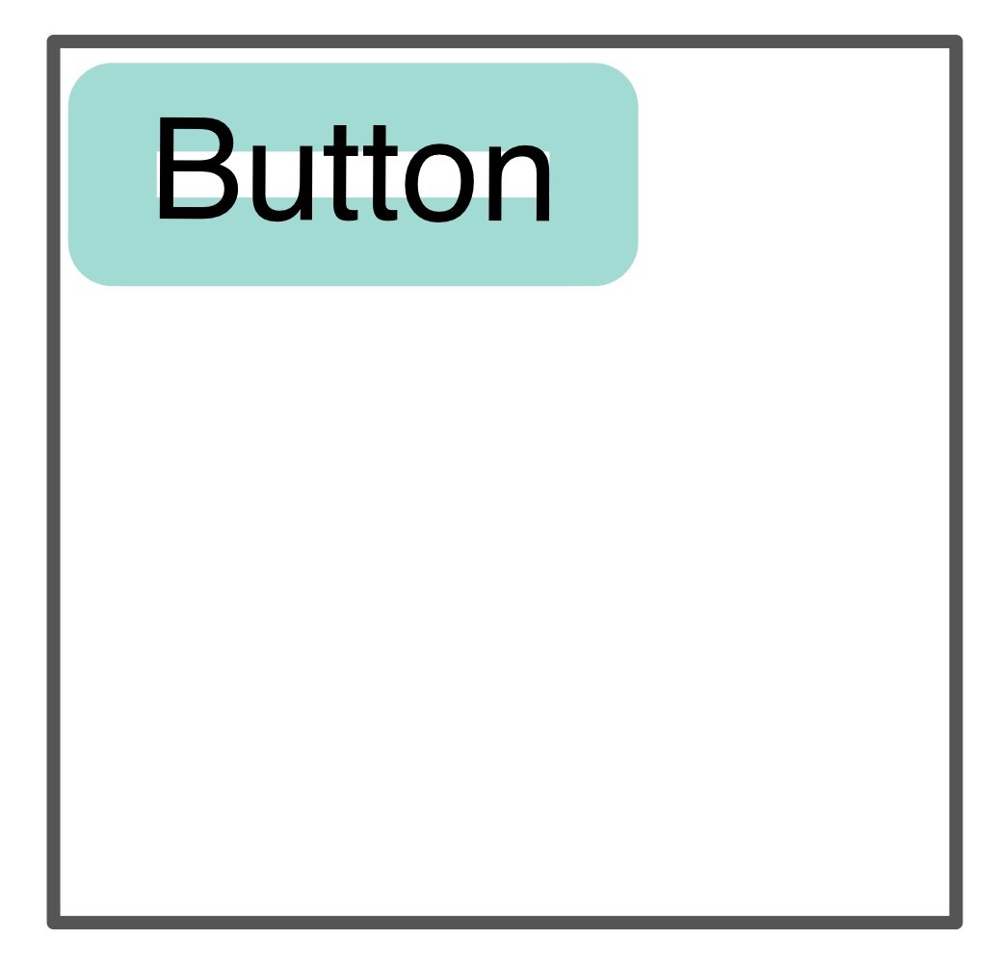
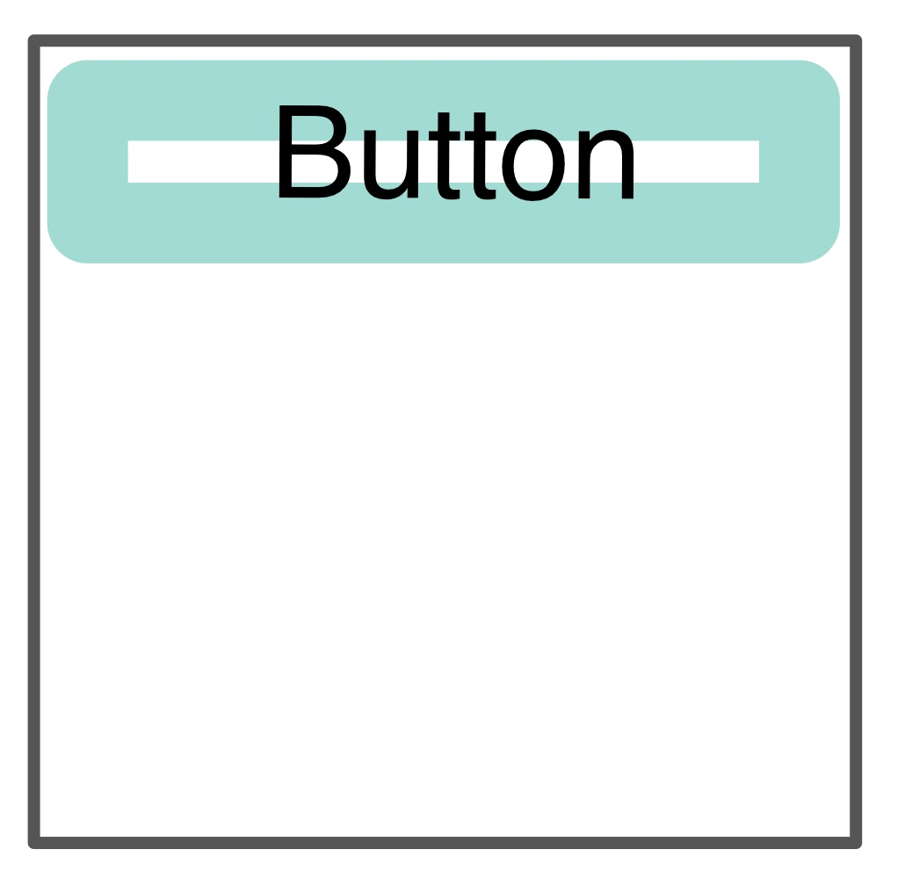
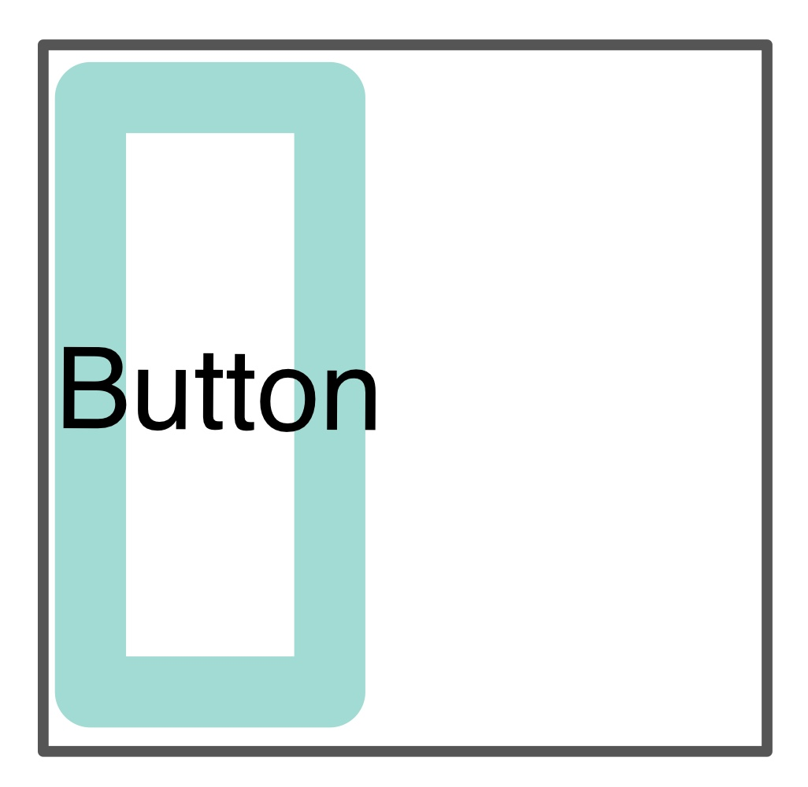
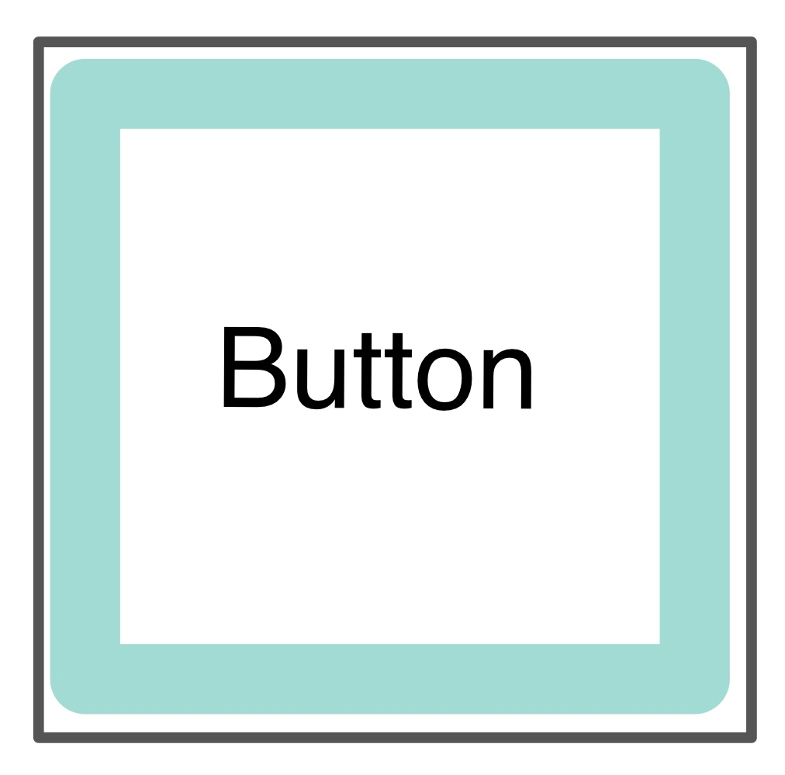

# 안드로이드 뷰(View)  
## ☝️ 안드로이드 화면 구성  
<br>
앱의 하나의 화면은 하나의 Activity가 관리하며, 화면은 다른 View들을 내부에 담는 ViewGroup과 화면 요소를 구성하는 Widget으로 구성된다. View는 주로 XML로 선언하나 java code에서 직접 작성도 가능하다.  

<br>

--------------------------------------------------------------------


## 1. 위젯 (Widget)
> 화면 입출력 요소를 표현하는 뷰 
### **위젯의 종류**
  
<br>

------------------------------------------------------------------

## 2. 뷰 그룹 (View Group)
> 위젯 또는 다른 뷰를 grouping 하거나, 배치할 때 사용하는 뷰
### **뷰 그룹의 종류**
 
<br>
<center> ❓ layout 안에 다른 layout이 위치할 수 있을까? <br>
 ✔️ View = widget + viewGroup 이기 때문에 할 수 있다! </center>
<br>

------------------------------------------------------------------

## 3. View의 공통 속성
### 3-1. **ID**
>특정 뷰를 참조하기 위한 식별 정보
- **형식** : _@[+]id/view_id_
  <br> 이때, [+]는 id를 새로 지을 때만 표시한다.

### 3-2. **layout_width / layout_height**
>뷰 그룹 안에서의 크기를 지정하는 속성
- **속성 값으로 사용 가능한 것들**
  1. **wrap_content** (fill_parent) : 담겨 있는 뷰그룹의 크기에 맞춘다.
  2. **match_parent** : 담고 있는 항목의 크기에 맞춘다. 
  3. 임의로 크기를 지정할 때는 값을 **단위와 함께 입력**한다  
(이때, 가능하면 논리 단위를 사용할 것! 기기별 해상도 차이 고려를 위해) 
<br> 1. **dp** : view의 크기 지정 시 사용 <br>
     2. **sp** : 문자열 크기 지정 시 사용 <br>

layout_width | wrap_content | match_parent | wrap_content | match_parent
--- | --- | --- | --- | ---
layout_height | wrap_content | wrap_content | match_parent | match_parent
view |  |  |  |  

<br>

------------------------------------------------------------------

## 4. 기본 위젯
### 4-1. **TextView**
> 문자열을 표시하는 위젯  
### 4-1-1. 주요 속성  
- **text**  
text는 표시할 문자열을 나타낸다.   
text 값을 지정하는 방법은 세가지가 있다.  

  1. **XML 상에서 직접 입력한다.**
  ```java
  <TextView android:text="hello!" />
  ```
  2. **다른 XML의 값을 읽어와 값을 지정한다.**
  ```java
  <TextView android:text="@string/hello_world!" />
  ```
  3. **코드에서 직접 텍스트로 입력한다.**  
  ```java
  TextView textView1 = (TextView)findViewById(R.id.hello_world);
  // 이 방법은 findViewById()를 사용하여 레이아웃에 배치한 위젯을 가져온 후 수행
  textView1.setText("hello!");
  ```
- **textColor** : 문자열의 색을 지정한다.
- **textSize** (sp 단위 사용 권장) : 문자열의 크기를 지정한다.
- **textStyle** (normal | bold | italic) : 문자열의 형태를 지정한다.
- **typeface** (fond - 폰트는 한정적)
- **singleLine**  

❗️ TextView의 출력 내용이 길어 Scroll이 필요할 경우에는 **_ScrollView_** 를 사용한다.  
<br>

### 4-2. **ImageView**
>이미지를 표시하는 위젯
### 4-2-1. 주요 속성
- **src** : 출력할 이미지의 아이디를 지정한다.
- **maxHeight / maxWidth** 
- **adjustViewBounds** : 가로/세로 비율 유지 여부를 결정한다.
- **cropToPadding** : 여백 조정 여부를 결정한다.
- **tint** : 이미지 위에 색조를 추가한다.
- **scaleType** : 이미지의 확대/축소 방식을 지정한다.

### 4-2-2. 이미지 파일 저장
>res/mipmap-XXX 폴더 사용
- 이미지 파일명 지정 시 주의할 점  
  1. 투명도를 조종하기 위해서는 가능하면 png 파일을 사용하는 것이 좋다.
  2. 이미지 파일명이 아이디로 자동 지정되므로 반드시 명명 규칙을 준수해야한다.  
 _❗️ 영어, 소문자, 밑줄, 숫자만 사용 가능 (한글, 대문자 불가)
    <br>❗️ 확장자로 구분되지 않으므로 파일명을 다르게 사용하여야 함 (dog.jpg == dog.png)_
 